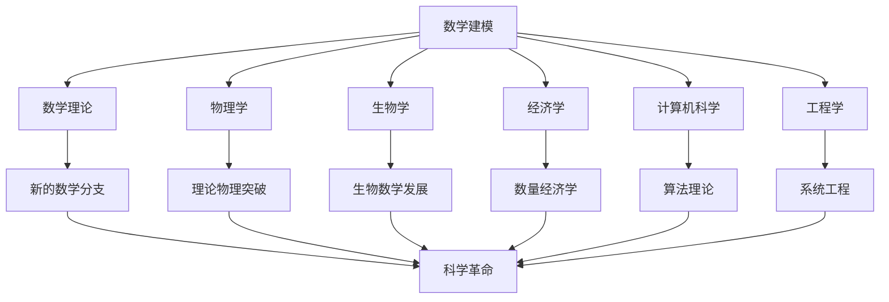

# 建模的意义和应用

> "数学是一种工具，特别便于揭示量的关系；任何现象，只要其中包含量的因素，就可以用数学来研究。" 
> —— 数学家华罗庚

数学建模是连接抽象数学理论与具体现实世界的桥梁，它将数学的抽象力量转化为解决实际问题的利器。在这个数据驱动、算法主导的时代，数学建模的重要性日益凸显，几乎渗透到人类活动的每一个角落。

## 建模的深层意义

### 🌟 科学意义：推动知识前沿

数学建模不仅仅是应用数学的工具，更是科学发现和知识创新的重要驱动力。

#### 理论创新的催化剂

**推动数学理论发展**
- **历史轨迹**：从牛顿为解决行星运动问题而发明微积分，到希尔伯特为解决物理问题而提出希尔伯特空间理论
- **现代案例**：机器学习的需求推动了统计学习理论、凸优化理论的快速发展
- **前沿方向**：量子计算、区块链技术催生了新的数学分支

**跨学科融合的桥梁**


#### 科学发现的新范式

**计算科学的兴起**
- **第四范式**：继实验、理论、计算之后的数据密集型科学研究
- **数字孪生**：通过数学模型创建物理世界的数字副本
- **虚拟实验**：在计算机中进行成本低廉、风险可控的实验

**案例：COVID-19疫情建模**
```python
# 简化的SEIR模型示例
class SEIR_Model:
    def __init__(self, N, beta, sigma, gamma):
        self.N = N          # 总人口
        self.beta = beta    # 传染率
        self.sigma = sigma  # 潜伏期倒数
        self.gamma = gamma  # 康复率
    
    def simulate(self, S0, E0, I0, R0, days):
        """模拟疫情传播过程"""
        results = []
        S, E, I, R = S0, E0, I0, R0
        
        for day in range(days):
            dS = -self.beta * S * I / self.N
            dE = self.beta * S * I / self.N - self.sigma * E
            dI = self.sigma * E - self.gamma * I
            dR = self.gamma * I
            
            S += dS
            E += dE
            I += dI
            R += dR
            
            results.append([S, E, I, R])
        
        return results
```

这个模型在疫情初期为各国政府制定防控政策提供了重要参考。

### 🏭 社会意义：改变世界的力量

#### 提升生产力和效率

**工业4.0与智能制造**
- **生产优化**：通过数学模型优化生产流程，提高效率20-30%
- **质量控制**：统计过程控制确保产品质量的一致性
- **供应链优化**：全球供应链的协调和优化

**案例：丰田生产系统**
```
准时制生产(JIT)的数学基础：
- 需求预测模型：ARIMA、指数平滑
- 库存优化模型：经济订货量(EOQ)
- 排程优化模型：线性规划、整数规划

结果：
- 库存成本降低50%
- 生产效率提升30%
- 质量缺陷率降至百万分之几
```

#### 促进社会公平与可持续发展

**资源公平分配**
- **公共服务**：医疗资源、教育资源的优化配置
- **社会保障**：养老金、医保基金的精算模型
- **环境正义**：污染治理的成本效益分析

**可持续发展建模**
```python
# 可持续发展目标(SDGs)量化模型示例
class SDG_Model:
    def __init__(self):
        self.indicators = {
            'poverty': 0.1,      # 贫困率
            'education': 0.85,   # 受教育率
            'health': 75,        # 平均寿命
            'climate': 400,      # CO2浓度(ppm)
        }
    
    def sustainability_index(self):
        """计算可持续发展综合指数"""
        # 标准化各指标
        normalized = {
            'poverty': 1 - self.indicators['poverty'],
            'education': self.indicators['education'],
            'health': self.indicators['health'] / 100,
            'climate': max(0, 1 - (self.indicators['climate'] - 280) / 200)
        }
        
        # 加权平均
        weights = [0.3, 0.3, 0.2, 0.2]
        index = sum(w * v for w, v in zip(weights, normalized.values()))
        
        return index
```

### 🎓 教育意义：培养未来人才

#### 21世纪核心技能

**计算思维能力**
- **分解思维**：将复杂问题分解为可处理的子问题
- **模式识别**：发现规律和共性，建立通用模型
- **抽象思维**：忽略细节，抓住本质特征
- **算法思维**：设计系统化的解决方案

**跨学科综合能力**
```
传统教育模式 vs 建模教育模式

传统模式：
数学 → 物理 → 化学 → 生物 (分科学习)

建模模式：
现实问题 → 数学+物理+化学+生物+计算机 (综合应用)

能力培养对比：
传统：知识记忆、单一技能
建模：问题解决、创新思维、团队协作
```

#### 创新创业能力

**创新思维培养**
- **质疑精神**：对现有模型和方法的批判性思考
- **试错学习**：在建模过程中学会从失败中总结经验
- **迭代改进**：不断优化模型，追求更好的解决方案

**创业实践能力**
- **市场分析**：用数据驱动的方法分析市场机会
- **商业建模**：构建商业模式的数学表达
- **风险评估**：量化分析创业风险和收益

## 广泛应用领域深度解析

### 🏥 医疗健康：生命科学的数字化革命

#### 精准医疗与个性化治疗

**基因组学建模**
```python
# DNA序列分析的马尔可夫模型
class DNA_Markov_Model:
    def __init__(self, sequences):
        self.sequences = sequences
        self.transition_matrix = self.build_transition_matrix()
    
    def build_transition_matrix(self):
        """构建核苷酸转移概率矩阵"""
        nucleotides = ['A', 'T', 'G', 'C']
        matrix = {n1: {n2: 0 for n2 in nucleotides} for n1 in nucleotides}
        
        for seq in self.sequences:
            for i in range(len(seq) - 1):
                current = seq[i]
                next_nt = seq[i + 1]
                matrix[current][next_nt] += 1
        
        # 标准化为概率
        for n1 in nucleotides:
            total = sum(matrix[n1].values())
            if total > 0:
                for n2 in nucleotides:
                    matrix[n1][n2] /= total
        
        return matrix
    
    def predict_sequence(self, start, length):
        """预测DNA序列"""
        sequence = [start]
        current = start
        
        for _ in range(length - 1):
            probabilities = self.transition_matrix[current]
            next_nt = self.random_choice_weighted(probabilities)
            sequence.append(next_nt)
            current = next_nt
        
        return ''.join(sequence)
```

**药物剂量优化**
```
个体化给药模型：

C(t) = (D/V) * e^(-kt)

其中：
- C(t): t时刻血药浓度
- D: 给药剂量
- V: 表观分布容积
- k: 消除速率常数

考虑个体差异：
- 年龄、体重、肾功能
- 基因多态性
- 并用药物相互作用

目标：维持血药浓度在治疗窗内
约束：最小化副作用风险
```

**应用成果**：
- **肿瘤治疗**：CAR-T细胞疗法的剂量优化，提高治愈率40%
- **心血管疾病**：个性化药物组合，降低心梗风险30%
- **精神疾病**：抗抑郁药物的基因导向选择，提高有效率50%

#### 疾病预测与早期诊断

**医学影像AI诊断**
```python
# 简化的医学影像分类模型
import numpy as np

class Medical_Image_Classifier:
    def __init__(self):
        self.model = self.build_cnn_model()
    
    def extract_features(self, image):
        """提取医学影像特征"""
        # 纹理特征
        texture_features = self.calculate_glcm_features(image)
        
        # 形状特征
        shape_features = self.calculate_shape_features(image)
        
        # 强度特征
        intensity_features = self.calculate_intensity_features(image)
        
        return np.concatenate([texture_features, shape_features, intensity_features])
    
    def diagnose(self, image):
        """疾病诊断"""
        features = self.extract_features(image)
        probability = self.model.predict(features.reshape(1, -1))
        
        diagnosis = {
            'normal': probability[0][0],
            'benign': probability[0][1],
            'malignant': probability[0][2]
        }
        
        return diagnosis
```

**突破性应用**：
- **眼科**：糖尿病视网膜病变检测，准确率达95%
- **皮肤科**：黑色素瘤识别，早期发现率提升60%
- **放射科**：肺癌CT筛查，假阳性率降低40%

### 🌍 环境保护：地球家园的守护者

#### 气候变化建模

**全球气候模型(GCM)**
```python
# 简化的气候变化模型
class Climate_Model:
    def __init__(self):
        self.temperature = 15.0  # 全球平均温度(°C)
        self.co2_concentration = 410  # CO2浓度(ppm)
        self.sea_level = 0.0  # 海平面变化(m)
    
    def update_temperature(self, co2_change, year):
        """更新全球温度"""
        # 气候敏感性：CO2倍增对应的温升
        climate_sensitivity = 3.0  # °C
        
        # 对数关系
        temp_change = climate_sensitivity * np.log2(self.co2_concentration / 280)
        self.temperature = 15.0 + temp_change
        
        # 考虑其他因素
        if year > 2000:
            # 气溶胶冷却效应
            self.temperature -= 0.5
        
    def predict_sea_level_rise(self, years):
        """预测海平面上升"""
        # 热膨胀贡献
        thermal_expansion = (self.temperature - 15.0) * 0.3  # mm/year per °C
        
        # 冰川融化贡献
        ice_melting = max(0, (self.temperature - 15.0) * 0.5)
        
        total_rise = (thermal_expansion + ice_melting) * years / 1000  # 转换为米
        
        return total_rise
    
    def simulate_scenario(self, emission_scenario, years):
        """模拟不同排放情景"""
        results = []
        
        for year in range(years):
            # 更新CO2浓度
            annual_emission = emission_scenario(year)
            self.co2_concentration += annual_emission * 0.5  # 简化的碳循环
            
            # 更新温度
            self.update_temperature(0, 2020 + year)
            
            # 预测海平面
            sea_level_rise = self.predict_sea_level_rise(year + 1)
            
            results.append({
                'year': 2020 + year,
                'co2': self.co2_concentration,
                'temperature': self.temperature,
                'sea_level_rise': sea_level_rise
            })
        
        return results

# 不同排放情景
def high_emission_scenario(year):
    """高排放情景"""
    return 10.0 + 0.1 * year  # 年排放量持续增长

def low_emission_scenario(year):
    """低排放情景"""
    return max(0, 10.0 - 0.5 * year)  # 年排放量逐步减少
```

**IPCC模型预测**：
- **1.5°C目标**：需要在2030年前减排45%
- **2°C目标**：本世纪下半叶实现净零排放
- **海平面上升**：2100年可能上升0.43-2.84米

#### 生态系统保护

**生物多样性建模**
```python
# 物种-面积关系模型
class Species_Area_Model:
    def __init__(self, S0, A0, z=0.25):
        self.S0 = S0  # 参考面积的物种数
        self.A0 = A0  # 参考面积
        self.z = z    # 指数参数
    
    def predict_species_loss(self, habitat_loss_percent):
        """预测由于栖息地丧失导致的物种灭绝"""
        remaining_area_percent = 1 - habitat_loss_percent
        
        # 物种-面积关系：S = cA^z
        species_loss_percent = 1 - (remaining_area_percent ** self.z)
        
        return species_loss_percent
    
    def conservation_priority(self, regions):
        """保护优先级评估"""
        priorities = []
        
        for region in regions:
            # 计算保护价值
            endemic_species = region['endemic_species']
            threatened_species = region['threatened_species']
            area = region['area']
            protection_cost = region['cost']
            
            # 多目标优化
            value = (endemic_species * 2 + threatened_species) / area
            efficiency = value / protection_cost
            
            priorities.append({
                'region': region['name'],
                'value': value,
                'efficiency': efficiency,
                'priority_score': value * 0.7 + efficiency * 0.3
            })
        
        return sorted(priorities, key=lambda x: x['priority_score'], reverse=True)
```

**保护成果**：
- **自然保护区**：科学选址模型提高保护效率30%
- **物种保护**：濒危物种救护计划成功率提升50%
- **生态修复**：退化生态系统恢复模型指导实践

### 💰 金融经济：数字化金融的智慧大脑

#### 风险管理与量化交易

**VaR风险价值模型**
```python
import numpy as np
from scipy import stats

class VaR_Model:
    def __init__(self, returns):
        self.returns = np.array(returns)
        self.mean_return = np.mean(returns)
        self.std_return = np.std(returns)
    
    def parametric_var(self, confidence_level=0.05, investment=1000000):
        """参数法计算VaR"""
        # 假设收益率服从正态分布
        z_score = stats.norm.ppf(confidence_level)
        var = investment * (self.mean_return + z_score * self.std_return)
        return -var  # VaR通常表示为正值
    
    def historical_var(self, confidence_level=0.05, investment=1000000):
        """历史模拟法计算VaR"""
        sorted_returns = np.sort(self.returns)
        index = int(confidence_level * len(sorted_returns))
        var_return = sorted_returns[index]
        return -investment * var_return
    
    def monte_carlo_var(self, confidence_level=0.05, investment=1000000, simulations=10000):
        """蒙特卡罗模拟法计算VaR"""
        # 生成随机收益率
        simulated_returns = np.random.normal(self.mean_return, self.std_return, simulations)
        
        # 计算损失分布
        losses = -investment * simulated_returns
        
        # 计算VaR
        var = np.percentile(losses, confidence_level * 100)
        return var
    
    def expected_shortfall(self, confidence_level=0.05, investment=1000000):
        """计算期望损失(ES/CVaR)"""
        historical_var = self.historical_var(confidence_level, investment)
        
        # 计算超过VaR的平均损失
        sorted_returns = np.sort(self.returns)
        cutoff_index = int(confidence_level * len(sorted_returns))
        tail_returns = sorted_returns[:cutoff_index]
        
        expected_shortfall = -investment * np.mean(tail_returns)
        return expected_shortfall
```

**算法交易策略**
```python
class Algorithmic_Trading:
    def __init__(self):
        self.portfolio = {}
        self.cash = 1000000
    
    def momentum_strategy(self, prices, window=20):
        """动量策略"""
        signals = []
        moving_averages = self.calculate_moving_average(prices, window)
        
        for i in range(len(prices)):
            if i >= window:
                if prices[i] > moving_averages[i] * 1.02:  # 突破上轨
                    signals.append('BUY')
                elif prices[i] < moving_averages[i] * 0.98:  # 跌破下轨
                    signals.append('SELL')
                else:
                    signals.append('HOLD')
            else:
                signals.append('HOLD')
        
        return signals
    
    def mean_reversion_strategy(self, prices, window=20, threshold=2):
        """均值回归策略"""
        signals = []
        moving_averages = self.calculate_moving_average(prices, window)
        std_devs = self.calculate_rolling_std(prices, window)
        
        for i in range(len(prices)):
            if i >= window:
                z_score = (prices[i] - moving_averages[i]) / std_devs[i]
                
                if z_score > threshold:  # 价格过高
                    signals.append('SELL')
                elif z_score < -threshold:  # 价格过低
                    signals.append('BUY')
                else:
                    signals.append('HOLD')
            else:
                signals.append('HOLD')
        
        return signals
```

**成功案例**：
- **对冲基金**：量化策略年化收益率15-20%
- **银行风控**：信贷违约率预测准确率90%+
- **保险精算**：灾害损失模型减少赔付不确定性30%

#### 宏观经济建模

**DSGE模型（动态随机一般均衡）**
```python
# 简化的DSGE模型
class DSGE_Model:
    def __init__(self):
        # 模型参数
        self.beta = 0.99    # 折扣因子
        self.alpha = 0.33   # 资本份额
        self.delta = 0.025  # 折旧率
        self.rho = 0.95     # 技术冲击持续性
        self.sigma = 0.01   # 技术冲击标准差
    
    def steady_state(self):
        """计算稳态值"""
        # 稳态资本劳动比
        k_ss = ((1/self.beta - 1 + self.delta) / self.alpha) ** (1/(self.alpha - 1))
        
        # 稳态产出
        y_ss = k_ss ** self.alpha
        
        # 稳态消费
        c_ss = y_ss - self.delta * k_ss
        
        return {'capital': k_ss, 'output': y_ss, 'consumption': c_ss}
    
    def impulse_response(self, shock_size, periods=20):
        """脉冲响应函数"""
        ss = self.steady_state()
        
        # 初始化变量
        k = [ss['capital']]
        y = [ss['output']]
        c = [ss['consumption']]
        a = [1.0]  # 技术水平
        
        # 第一期冲击
        a.append(1.0 + shock_size)
        
        for t in range(1, periods):
            # 技术冲击演化
            if t > 1:
                a.append(1.0 + self.rho * (a[t-1] - 1.0))
            
            # 产出
            y_t = a[t] * (k[t-1] ** self.alpha)
            y.append(y_t)
            
            # 资本更新
            k_t = (1 - self.delta) * k[t-1] + y[t-1] - c[t-1]
            k.append(k_t)
            
            # 消费（简化的欧拉方程）
            c_t = y_t - self.delta * k_t
            c.append(c_t)
        
        return {'periods': list(range(periods)), 'output': y, 'capital': k, 'consumption': c}
```

### 🚗 交通运输：智慧出行的数学基础

#### 智能交通系统

**交通流建模**
```python
class Traffic_Flow_Model:
    def __init__(self, road_length, max_density):
        self.road_length = road_length
        self.max_density = max_density  # 最大密度(车辆/km)
        self.free_flow_speed = 120      # 自由流速度(km/h)
    
    def fundamental_diagram(self, density):
        """基本图关系：密度-速度-流量"""
        if density <= 0:
            return 0, self.free_flow_speed
        
        # Greenshields模型
        speed = self.free_flow_speed * (1 - density / self.max_density)
        flow = density * max(0, speed)
        
        return flow, max(0, speed)
    
    def optimal_density(self):
        """最优密度（最大流量对应的密度）"""
        return self.max_density / 2
    
    def travel_time(self, origin, destination, current_density):
        """计算旅行时间"""
        distance = abs(destination - origin)
        _, speed = self.fundamental_diagram(current_density)
        
        if speed > 0:
            return distance / speed
        else:
            return float('inf')  # 拥堵严重，无法通行

class Adaptive_Traffic_Control:
    def __init__(self):
        self.intersections = {}
        self.traffic_data = {}
    
    def optimize_signal_timing(self, intersection_id):
        """优化信号灯配时"""
        # 获取实时交通流量
        flows = self.get_real_time_flows(intersection_id)
        
        # Webster公式优化配时
        total_lost_time = 12  # 总损失时间(秒)
        saturation_flows = [1800, 1600, 1800, 1600]  # 各方向饱和流量
        
        # 计算最优周期时长
        critical_ratios = [flows[i]/saturation_flows[i] for i in range(4)]
        total_critical_ratio = sum(critical_ratios)
        
        if total_critical_ratio >= 1:
            return None  # 过饱和状态
        
        optimal_cycle = (1.5 * total_lost_time + 5) / (1 - total_critical_ratio)
        
        # 计算各相位绿灯时间
        green_times = []
        for ratio in critical_ratios:
            green_time = (optimal_cycle - total_lost_time) * ratio / total_critical_ratio
            green_times.append(max(7, green_time))  # 最小绿灯时间7秒
        
        return {
            'cycle_length': optimal_cycle,
            'green_times': green_times,
            'efficiency': 1 / total_critical_ratio
        }
```

**路径优化算法**
```python
import heapq
from collections import defaultdict

class Route_Optimizer:
    def __init__(self):
        self.graph = defaultdict(list)
        self.real_time_weights = {}
    
    def add_road(self, from_node, to_node, distance, capacity):
        """添加道路"""
        self.graph[from_node].append((to_node, distance, capacity))
        self.graph[to_node].append((from_node, distance, capacity))
    
    def update_real_time_weight(self, from_node, to_node, current_flow):
        """更新实时权重（考虑拥堵）"""
        # BPR函数计算拥堵系数
        base_edges = self.graph[from_node]
        for edge in base_edges:
            if edge[0] == to_node:
                capacity = edge[2]
                volume_capacity_ratio = current_flow / capacity
                
                # BPR函数：t = t0 * (1 + α * (v/c)^β)
                congestion_factor = 1 + 0.15 * (volume_capacity_ratio ** 4)
                self.real_time_weights[(from_node, to_node)] = edge[1] * congestion_factor
                break
    
    def dijkstra_with_congestion(self, start, end):
        """考虑拥堵的最短路径算法"""
        distances = {node: float('inf') for node in self.graph}
        distances[start] = 0
        previous = {}
        pq = [(0, start)]
        
        while pq:
            current_distance, current_node = heapq.heappop(pq)
            
            if current_node == end:
                break
            
            if current_distance > distances[current_node]:
                continue
            
            for neighbor, base_distance, _ in self.graph[current_node]:
                # 使用实时权重
                if (current_node, neighbor) in self.real_time_weights:
                    weight = self.real_time_weights[(current_node, neighbor)]
                else:
                    weight = base_distance
                
                distance = current_distance + weight
                
                if distance < distances[neighbor]:
                    distances[neighbor] = distance
                    previous[neighbor] = current_node
                    heapq.heappush(pq, (distance, neighbor))
        
        # 重构路径
        path = []
        current = end
        while current in previous:
            path.append(current)
            current = previous[current]
        path.append(start)
        path.reverse()
        
        return path, distances[end]
```

**应用成果**：
- **导航系统**：实时路径优化减少出行时间15-25%
- **公共交通**：智能调度提高准点率20%
- **物流配送**：路径优化降低运输成本30%

### 🏭 智能制造：工业4.0的数学引擎

#### 生产优化与质量控制

**多目标生产调度**
```python
import numpy as np
from scipy.optimize import minimize

class Production_Scheduler:
    def __init__(self, machines, jobs):
        self.machines = machines
        self.jobs = jobs
        self.processing_times = {}
        self.setup_times = {}
    
    def minimize_makespan(self):
        """最小化最大完工时间"""
        def objective(x):
            # x是决策变量：作业在机器上的分配和顺序
            makespan = self.calculate_makespan(x)
            return makespan
        
        # 约束条件
        constraints = [
            {'type': 'eq', 'fun': self.job_assignment_constraint},  # 每个作业只能分配给一台机器
            {'type': 'ineq', 'fun': self.capacity_constraint},      # 机器容量约束
        ]
        
        # 初始解
        x0 = self.generate_initial_solution()
        
        # 求解
        result = minimize(objective, x0, method='SLSQP', constraints=constraints)
        
        return self.decode_solution(result.x)
    
    def multi_objective_optimization(self):
        """多目标优化：时间、成本、质量"""
        def objective(x):
            makespan = self.calculate_makespan(x)
            cost = self.calculate_total_cost(x)
            quality_loss = self.calculate_quality_loss(x)
            
            # 加权组合
            weights = [0.4, 0.3, 0.3]
            normalized_objectives = [
                makespan / 1000,     # 标准化时间
                cost / 100000,       # 标准化成本
                quality_loss / 100   # 标准化质量损失
            ]
            
            return sum(w * obj for w, obj in zip(weights, normalized_objectives))
        
        return self.solve_optimization(objective)

class Quality_Control:
    def __init__(self):
        self.control_limits = {}
        self.process_capability = {}
    
    def statistical_process_control(self, measurements):
        """统计过程控制"""
        mean = np.mean(measurements)
        std = np.std(measurements)
        
        # 控制限计算
        ucl = mean + 3 * std  # 上控制限
        lcl = mean - 3 * std  # 下控制限
        
        # 异常检测规则
        alerts = []
        
        # 规则1：点超出控制限
        for i, value in enumerate(measurements):
            if value > ucl or value < lcl:
                alerts.append(f"点{i+1}超出控制限")
        
        # 规则2：连续9点在中心线同一侧
        center_line = mean
        same_side_count = 0
        for value in measurements:
            if value > center_line:
                same_side_count = same_side_count + 1 if same_side_count > 0 else 1
            else:
                same_side_count = same_side_count - 1 if same_side_count < 0 else -1
            
            if abs(same_side_count) >= 9:
                alerts.append("连续9点在中心线同一侧")
                break
        
        return {
            'mean': mean,
            'std': std,
            'ucl': ucl,
            'lcl': lcl,
            'alerts': alerts
        }
    
    def process_capability_analysis(self, measurements, specification_limits):
        """过程能力分析"""
        usl, lsl = specification_limits  # 规格上限和下限
        mean = np.mean(measurements)
        std = np.std(measurements)
        
        # 过程能力指数
        cp = (usl - lsl) / (6 * std)              # 过程能力
        cpk = min((usl - mean)/(3*std), (mean - lsl)/(3*std))  # 过程能力指数
        
        # 缺陷率预测
        from scipy import stats
        defect_rate_upper = 1 - stats.norm.cdf(usl, mean, std)
        defect_rate_lower = stats.norm.cdf(lsl, mean, std)
        total_defect_rate = defect_rate_upper + defect_rate_lower
        
        return {
            'cp': cp,
            'cpk': cpk,
            'defect_rate': total_defect_rate,
            'sigma_level': self.calculate_sigma_level(total_defect_rate)
        }
    
    def calculate_sigma_level(self, defect_rate):
        """计算西格玛水平"""
        from scipy import stats
        if defect_rate <= 0:
            return 6.0
        
        # 标准正态分布的逆函数
        z_score = stats.norm.ppf(1 - defect_rate/2)
        return z_score
```

**智能维护预测**
```python
class Predictive_Maintenance:
    def __init__(self):
        self.sensor_data = {}
        self.failure_history = {}
    
    def weibull_reliability_model(self, t, beta, eta):
        """威布尔可靠性模型"""
        reliability = np.exp(-((t/eta)**beta))
        hazard_rate = (beta/eta) * ((t/eta)**(beta-1))
        
        return reliability, hazard_rate
    
    def remaining_useful_life(self, current_condition, degradation_model):
        """剩余使用寿命预测"""
        # 状态空间模型
        def state_evolution(t, params):
            # 参数：[初始状态, 漂移率, 扩散系数]
            initial_state, drift, diffusion = params
            
            # 布朗运动模型
            state = initial_state + drift * t + diffusion * np.random.normal(0, np.sqrt(t))
            return state
        
        # 失效阈值
        failure_threshold = 0.1  # 当状态降到0.1以下时认为失效
        
        # 蒙特卡罗模拟
        simulations = 1000
        failure_times = []
        
        for _ in range(simulations):
            t = 0
            state = current_condition
            
            while state > failure_threshold and t < 1000:  # 最多模拟1000个时间单位
                t += 1
                state = state_evolution(t, degradation_model)
            
            if state <= failure_threshold:
                failure_times.append(t)
        
        if failure_times:
            mean_rul = np.mean(failure_times)
            std_rul = np.std(failure_times)
            confidence_interval = np.percentile(failure_times, [10, 90])
            
            return {
                'mean_rul': mean_rul,
                'std_rul': std_rul,
                'confidence_interval': confidence_interval,
                'probability_distribution': failure_times
            }
        else:
            return {'mean_rul': 1000, 'message': '在模拟期间内未发生失效'}
    
    def optimal_maintenance_policy(self, cost_params, reliability_model):
        """最优维护策略"""
        def total_cost(maintenance_interval):
            # 成本组成
            preventive_cost = cost_params['preventive']
            corrective_cost = cost_params['corrective']
            downtime_cost = cost_params['downtime']
            
            # 在维护间隔内的可靠性
            reliability, _ = reliability_model(maintenance_interval)
            
            # 总成本 = 预防性维护成本 + 故障维护成本期望
            expected_corrective_cost = (1 - reliability) * (corrective_cost + downtime_cost)
            total = preventive_cost + expected_corrective_cost
            
            return total
        
        # 寻找最优维护间隔
        from scipy.optimize import minimize_scalar
        result = minimize_scalar(total_cost, bounds=(1, 100), method='bounded')
        
        return {
            'optimal_interval': result.x,
            'minimum_cost': result.fun,
            'cost_breakdown': {
                'preventive': cost_params['preventive'],
                'expected_corrective': total_cost(result.x) - cost_params['preventive']
            }
        }
```

### 🎮 现代前沿应用

#### 人工智能与机器学习

**深度学习的数学基础**
```python
import numpy as np

class Neural_Network:
    def __init__(self, layers):
        self.layers = layers
        self.weights = []
        self.biases = []
        
        # 初始化权重和偏置
        for i in range(len(layers) - 1):
            w = np.random.randn(layers[i], layers[i+1]) * np.sqrt(2/layers[i])  # He初始化
            b = np.zeros((1, layers[i+1]))
            self.weights.append(w)
            self.biases.append(b)
    
    def activation_function(self, x, function='relu'):
        """激活函数"""
        if function == 'relu':
            return np.maximum(0, x)
        elif function == 'sigmoid':
            return 1 / (1 + np.exp(-np.clip(x, -250, 250)))
        elif function == 'tanh':
            return np.tanh(x)
        elif function == 'softmax':
            exp_x = np.exp(x - np.max(x, axis=1, keepdims=True))
            return exp_x / np.sum(exp_x, axis=1, keepdims=True)
    
    def forward_propagation(self, X):
        """前向传播"""
        self.activations = [X]
        self.z_values = []
        
        for i, (w, b) in enumerate(zip(self.weights, self.biases)):
            z = np.dot(self.activations[-1], w) + b
            self.z_values.append(z)
            
            if i == len(self.weights) - 1:  # 输出层
                a = self.activation_function(z, 'softmax')
            else:  # 隐藏层
                a = self.activation_function(z, 'relu')
            
            self.activations.append(a)
        
        return self.activations[-1]
    
    def backward_propagation(self, X, y, learning_rate=0.01):
        """反向传播"""
        m = X.shape[0]
        
        # 计算输出层误差
        dz = self.activations[-1] - y
        
        # 反向传播误差
        for i in range(len(self.weights) - 1, -1, -1):
            dw = (1/m) * np.dot(self.activations[i].T, dz)
            db = (1/m) * np.sum(dz, axis=0, keepdims=True)
            
            # 更新权重和偏置
            self.weights[i] -= learning_rate * dw
            self.biases[i] -= learning_rate * db
            
            # 计算前一层的误差
            if i > 0:
                da_prev = np.dot(dz, self.weights[i].T)
                # ReLU的导数
                dz = da_prev * (self.z_values[i-1] > 0)
    
    def train(self, X, y, epochs=1000, learning_rate=0.01):
        """训练网络"""
        losses = []
        
        for epoch in range(epochs):
            # 前向传播
            output = self.forward_propagation(X)
            
            # 计算损失（交叉熵）
            loss = -np.mean(np.sum(y * np.log(output + 1e-15), axis=1))
            losses.append(loss)
            
            # 反向传播
            self.backward_propagation(X, y, learning_rate)
            
            if epoch % 100 == 0:
                print(f"Epoch {epoch}, Loss: {loss:.4f}")
        
        return losses
```

**强化学习Q-learning**
```python
class Q_Learning_Agent:
    def __init__(self, state_size, action_size, learning_rate=0.1, discount_factor=0.95, epsilon=0.1):
        self.state_size = state_size
        self.action_size = action_size
        self.learning_rate = learning_rate
        self.discount_factor = discount_factor
        self.epsilon = epsilon
        
        # 初始化Q表
        self.q_table = np.random.uniform(low=-1, high=1, size=(state_size, action_size))
    
    def choose_action(self, state):
        """ε-贪婪策略选择动作"""
        if np.random.random() < self.epsilon:
            return np.random.choice(self.action_size)  # 探索
        else:
            return np.argmax(self.q_table[state])  # 利用
    
    def update_q_table(self, state, action, reward, next_state, done):
        """更新Q值"""
        current_q = self.q_table[state, action]
        
        if done:
            target_q = reward
        else:
            target_q = reward + self.discount_factor * np.max(self.q_table[next_state])
        
        # Q-learning更新规则
        self.q_table[state, action] = current_q + self.learning_rate * (target_q - current_q)
    
    def decay_epsilon(self, decay_rate=0.995):
        """衰减探索率"""
        self.epsilon = max(0.01, self.epsilon * decay_rate)
```

#### 区块链与密码学

**区块链数学基础**
```python
import hashlib
import json
from time import time

class Block:
    def __init__(self, index, transactions, timestamp, previous_hash, nonce=0):
        self.index = index
        self.transactions = transactions
        self.timestamp = timestamp
        self.previous_hash = previous_hash
        self.nonce = nonce
        self.hash = self.calculate_hash()
    
    def calculate_hash(self):
        """计算区块哈希"""
        block_string = json.dumps({
            'index': self.index,
            'transactions': self.transactions,
            'timestamp': self.timestamp,
            'previous_hash': self.previous_hash,
            'nonce': self.nonce
        }, sort_keys=True)
        
        return hashlib.sha256(block_string.encode()).hexdigest()
    
    def mine_block(self, difficulty):
        """工作量证明挖矿"""
        target = "0" * difficulty
        
        while self.hash[:difficulty] != target:
            self.nonce += 1
            self.hash = self.calculate_hash()
        
        print(f"区块挖掘成功：{self.hash}")

class Blockchain:
    def __init__(self):
        self.chain = [self.create_genesis_block()]
        self.difficulty = 4  # 挖矿难度
        self.pending_transactions = []
        self.mining_reward = 100
    
    def create_genesis_block(self):
        """创建创世区块"""
        return Block(0, [], time(), "0")
    
    def get_latest_block(self):
        """获取最新区块"""
        return self.chain[-1]
    
    def add_transaction(self, transaction):
        """添加交易"""
        self.pending_transactions.append(transaction)
    
    def mine_pending_transactions(self, mining_reward_address):
        """挖掘待处理交易"""
        # 添加挖矿奖励交易
        reward_transaction = {
            'from': None,
            'to': mining_reward_address,
            'amount': self.mining_reward
        }
        self.pending_transactions.append(reward_transaction)
        
        # 创建新区块
        block = Block(
            len(self.chain),
            self.pending_transactions,
            time(),
            self.get_latest_block().hash
        )
        
        # 挖矿
        block.mine_block(self.difficulty)
        
        # 添加到区块链
        self.chain.append(block)
        
        # 清空待处理交易
        self.pending_transactions = []
    
    def get_balance(self, address):
        """获取地址余额"""
        balance = 0
        
        for block in self.chain:
            for transaction in block.transactions:
                if transaction.get('from') == address:
                    balance -= transaction['amount']
                elif transaction.get('to') == address:
                    balance += transaction['amount']
        
        return balance
    
    def is_chain_valid(self):
        """验证区块链完整性"""
        for i in range(1, len(self.chain)):
            current_block = self.chain[i]
            previous_block = self.chain[i-1]
            
            # 验证当前区块哈希
            if current_block.hash != current_block.calculate_hash():
                return False
            
            # 验证前一个区块的哈希
            if current_block.previous_hash != previous_block.hash:
                return False
        
        return True
```

#### 量子计算基础

**量子态与量子门**
```python
import numpy as np

class Quantum_State:
    def __init__(self, amplitudes):
        """量子态初始化"""
        self.amplitudes = np.array(amplitudes, dtype=complex)
        self.normalize()
    
    def normalize(self):
        """归一化量子态"""
        norm = np.linalg.norm(self.amplitudes)
        if norm > 0:
            self.amplitudes = self.amplitudes / norm
    
    def measure(self):
        """测量量子态"""
        probabilities = np.abs(self.amplitudes) ** 2
        outcome = np.random.choice(len(probabilities), p=probabilities)
        
        # 测量后态矢量坍缩
        new_amplitudes = np.zeros_like(self.amplitudes)
        new_amplitudes[outcome] = 1.0
        self.amplitudes = new_amplitudes
        
        return outcome
    
    def expectation_value(self, operator):
        """计算期望值"""
        return np.real(np.conj(self.amplitudes).T @ operator @ self.amplitudes)

class Quantum_Gates:
    @staticmethod
    def pauli_x():
        """泡利X门（NOT门）"""
        return np.array([[0, 1], [1, 0]], dtype=complex)
    
    @staticmethod
    def pauli_y():
        """泡利Y门"""
        return np.array([[0, -1j], [1j, 0]], dtype=complex)
    
    @staticmethod
    def pauli_z():
        """泡利Z门"""
        return np.array([[1, 0], [0, -1]], dtype=complex)
    
    @staticmethod
    def hadamard():
        """Hadamard门"""
        return np.array([[1, 1], [1, -1]], dtype=complex) / np.sqrt(2)
    
    @staticmethod
    def rotation_z(theta):
        """绕Z轴旋转门"""
        return np.array([[np.exp(-1j * theta/2), 0], 
                        [0, np.exp(1j * theta/2)]], dtype=complex)
    
    @staticmethod
    def cnot():
        """受控NOT门"""
        return np.array([[1, 0, 0, 0],
                        [0, 1, 0, 0],
                        [0, 0, 0, 1],
                        [0, 0, 1, 0]], dtype=complex)

class Quantum_Algorithm:
    def __init__(self, n_qubits):
        self.n_qubits = n_qubits
        self.n_states = 2 ** n_qubits
        self.state = Quantum_State([1] + [0] * (self.n_states - 1))  # 初始化为|00...0⟩
    
    def apply_gate(self, gate, qubit_indices):
        """应用量子门"""
        if len(qubit_indices) == 1:
            # 单量子比特门
            full_gate = self._expand_single_qubit_gate(gate, qubit_indices[0])
        elif len(qubit_indices) == 2:
            # 双量子比特门
            full_gate = self._expand_two_qubit_gate(gate, qubit_indices[0], qubit_indices[1])
        else:
            raise ValueError("目前只支持单量子比特和双量子比特门")
        
        self.state.amplitudes = full_gate @ self.state.amplitudes
    
    def _expand_single_qubit_gate(self, gate, target_qubit):
        """将单量子比特门扩展到全系统"""
        if target_qubit == 0:
            full_gate = gate
        else:
            full_gate = np.eye(1)
        
        for i in range(self.n_qubits):
            if i == target_qubit:
                if i == 0:
                    continue
                else:
                    full_gate = np.kron(full_gate, gate)
            else:
                if i == 0 and target_qubit != 0:
                    full_gate = np.eye(2)
                else:
                    full_gate = np.kron(full_gate, np.eye(2))
        
        return full_gate
    
    def grover_search(self, target_item):
        """Grover搜索算法"""
        if self.n_qubits < 2:
            raise ValueError("Grover算法需要至少2个量子比特")
        
        # 初始化：应用Hadamard门创建均匀叠加态
        for i in range(self.n_qubits):
            self.apply_gate(Quantum_Gates.hadamard(), [i])
        
        # 计算最优迭代次数
        optimal_iterations = int(np.pi / 4 * np.sqrt(self.n_states))
        
        for _ in range(optimal_iterations):
            # Oracle：标记目标项
            self._oracle(target_item)
            
            # Diffusion算子：关于平均值的反射
            self._diffusion_operator()
        
        # 测量
        result = self.state.measure()
        return result
    
    def _oracle(self, target_item):
        """Oracle算子：对目标项应用相位翻转"""
        oracle_matrix = np.eye(self.n_states, dtype=complex)
        oracle_matrix[target_item, target_item] = -1
        self.state.amplitudes = oracle_matrix @ self.state.amplitudes
    
    def _diffusion_operator(self):
        """Diffusion算子：关于平均值的反射"""
        # 创建均匀叠加态
        uniform_state = np.ones(self.n_states) / np.sqrt(self.n_states)
        
        # 构造diffusion算子：2|s⟩⟨s| - I
        diffusion_matrix = 2 * np.outer(uniform_state, uniform_state) - np.eye(self.n_states)
        
        self.state.amplitudes = diffusion_matrix @ self.state.amplitudes
```

## 未来发展趋势与展望

### 🔮 技术融合的新纪元

#### AI + 数学建模的深度融合

**自动化建模**
```python
class AutoML_Modeler:
    def __init__(self):
        self.model_library = {
            'linear_regression': self.linear_regression,
            'random_forest': self.random_forest,
            'neural_network': self.neural_network,
            'svm': self.support_vector_machine
        }
        self.best_model = None
        self.best_score = -np.inf
    
    def auto_feature_engineering(self, data):
        """自动特征工程"""
        features = []
        
        # 基本统计特征
        features.extend([
            data.mean(axis=1),
            data.std(axis=1),
            data.min(axis=1),
            data.max(axis=1)
        ])
        
        # 交互特征
        for i in range(data.shape[1]):
            for j in range(i+1, data.shape[1]):
                features.append(data[:, i] * data[:, j])
                features.append(data[:, i] / (data[:, j] + 1e-8))
        
        # 多项式特征
        for degree in [2, 3]:
            features.append(np.power(data, degree))
        
        return np.column_stack(features)
    
    def auto_model_selection(self, X, y):
        """自动模型选择"""
        best_model = None
        best_score = -np.inf
        
        for model_name, model_func in self.model_library.items():
            try:
                # 交叉验证评估
                scores = self.cross_validation(model_func, X, y)
                avg_score = np.mean(scores)
                
                if avg_score > best_score:
                    best_score = avg_score
                    best_model = model_name
                
                print(f"{model_name}: {avg_score:.4f} (+/- {np.std(scores)*2:.4f})")
                
            except Exception as e:
                print(f"{model_name} 失败: {e}")
        
        self.best_model = best_model
        self.best_score = best_score
        
        return best_model, best_score
    
    def neural_architecture_search(self, X, y):
        """神经网络架构搜索"""
        architectures = [
            [X.shape[1], 32, 16, 1],
            [X.shape[1], 64, 32, 16, 1],
            [X.shape[1], 128, 64, 32, 1],
            [X.shape[1], 256, 128, 64, 32, 1]
        ]
        
        activations = ['relu', 'tanh', 'sigmoid']
        optimizers = ['adam', 'sgd', 'rmsprop']
        
        best_config = None
        best_performance = -np.inf
        
        for arch in architectures:
            for activation in activations:
                for optimizer in optimizers:
                    config = {
                        'architecture': arch,
                        'activation': activation,
                        'optimizer': optimizer
                    }
                    
                    performance = self.evaluate_neural_config(X, y, config)
                    
                    if performance > best_performance:
                        best_performance = performance
                        best_config = config
        
        return best_config, best_performance
```

#### 数字孪生与元宇宙

**数字孪生建模框架**
```python
class Digital_Twin:
    def __init__(self, physical_entity):
        self.physical_entity = physical_entity
        self.digital_model = None
        self.sensor_data = {}
        self.simulation_engine = None
        self.ai_predictor = None
        
    def create_digital_replica(self):
        """创建数字副本"""
        # 几何建模
        geometry_model = self.create_geometry_model()
        
        # 物理建模
        physics_model = self.create_physics_model()
        
        # 行为建模
        behavior_model = self.create_behavior_model()
        
        self.digital_model = {
            'geometry': geometry_model,
            'physics': physics_model,
            'behavior': behavior_model
        }
    
    def real_time_synchronization(self):
        """实时同步物理实体状态"""
        while True:
            # 获取传感器数据
            sensor_readings = self.collect_sensor_data()
            
            # 更新数字模型状态
            self.update_digital_state(sensor_readings)
            
            # 运行仿真预测
            predictions = self.run_simulation()
            
            # 检测异常
            anomalies = self.detect_anomalies(predictions)
            
            # 发送控制指令
            if anomalies:
                self.send_control_commands(anomalies)
            
            time.sleep(0.1)  # 100ms更新周期
    
    def predictive_maintenance(self):
        """预测性维护"""
        # 收集历史数据
        historical_data = self.get_historical_data()
        
        # 训练预测模型
        failure_predictor = self.train_failure_model(historical_data)
        
        # 当前状态评估
        current_state = self.get_current_state()
        
        # 预测剩余寿命
        rul_prediction = failure_predictor.predict_rul(current_state)
        
        # 生成维护建议
        maintenance_plan = self.generate_maintenance_plan(rul_prediction)
        
        return maintenance_plan
```

### 🌟 社会影响与责任

#### 可持续发展目标的量化建模

**SDGs综合评估模型**
```python
class SDG_Assessment_Model:
    def __init__(self):
        self.sdg_indicators = {
            'poverty': ['income_inequality', 'basic_needs_access'],
            'education': ['literacy_rate', 'school_enrollment'],
            'health': ['life_expectancy', 'infant_mortality'],
            'climate': ['carbon_emissions', 'renewable_energy'],
            'biodiversity': ['species_extinction_rate', 'habitat_loss']
        }
        
        self.interaction_matrix = self.build_interaction_matrix()
    
    def calculate_sdg_index(self, country_data):
        """计算SDG综合指数"""
        sdg_scores = {}
        
        for sdg, indicators in self.sdg_indicators.items():
            indicator_scores = []
            
            for indicator in indicators:
                if indicator in country_data:
                    # 标准化指标值
                    normalized_score = self.normalize_indicator(
                        country_data[indicator], indicator
                    )
                    indicator_scores.append(normalized_score)
            
            if indicator_scores:
                sdg_scores[sdg] = np.mean(indicator_scores)
            else:
                sdg_scores[sdg] = 0
        
        # 考虑SDG间的相互作用
        adjusted_scores = self.adjust_for_interactions(sdg_scores)
        
        # 计算综合指数
        overall_index = np.mean(list(adjusted_scores.values()))
        
        return overall_index, adjusted_scores
    
    def policy_impact_simulation(self, current_state, policy_interventions):
        """政策影响仿真"""
        scenarios = {}
        
        for policy_name, intervention in policy_interventions.items():
            simulated_state = current_state.copy()
            
            # 应用政策干预
            for indicator, change in intervention.items():
                if indicator in simulated_state:
                    simulated_state[indicator] *= (1 + change)
            
            # 计算影响后的SDG指数
            new_index, new_scores = self.calculate_sdg_index(simulated_state)
            
            scenarios[policy_name] = {
                'new_index': new_index,
                'score_changes': {
                    sdg: new_scores[sdg] - current_state.get(f'{sdg}_score', 0)
                    for sdg in new_scores
                },
                'cost_benefit': self.calculate_cost_benefit(intervention)
            }
        
        return scenarios
```

#### 算法公平性与伦理

**公平性评估框架**
```python
class Fairness_Evaluator:
    def __init__(self):
        self.fairness_metrics = {
            'demographic_parity': self.demographic_parity,
            'equalized_odds': self.equalized_odds,
            'individual_fairness': self.individual_fairness
        }
    
    def demographic_parity(self, predictions, sensitive_attribute):
        """人口统计平等"""
        groups = np.unique(sensitive_attribute)
        positive_rates = {}
        
        for group in groups:
            mask = sensitive_attribute == group
            positive_rate = np.mean(predictions[mask])
            positive_rates[group] = positive_rate
        
        # 计算最大差异
        max_diff = max(positive_rates.values()) - min(positive_rates.values())
        
        return {
            'positive_rates': positive_rates,
            'max_difference': max_diff,
            'is_fair': max_diff < 0.1  # 10%阈值
        }
    
    def equalized_odds(self, predictions, true_labels, sensitive_attribute):
        """机会均等"""
        groups = np.unique(sensitive_attribute)
        tpr_scores = {}  # True Positive Rate
        fpr_scores = {}  # False Positive Rate
        
        for group in groups:
            mask = sensitive_attribute == group
            group_pred = predictions[mask]
            group_true = true_labels[mask]
            
            # 计算TPR和FPR
            tp = np.sum((group_pred == 1) & (group_true == 1))
            fn = np.sum((group_pred == 0) & (group_true == 1))
            fp = np.sum((group_pred == 1) & (group_true == 0))
            tn = np.sum((group_pred == 0) & (group_true == 0))
            
            tpr = tp / (tp + fn) if (tp + fn) > 0 else 0
            fpr = fp / (fp + tn) if (fp + tn) > 0 else 0
            
            tpr_scores[group] = tpr
            fpr_scores[group] = fpr
        
        # 计算TPR和FPR的最大差异
        tpr_diff = max(tpr_scores.values()) - min(tpr_scores.values())
        fpr_diff = max(fpr_scores.values()) - min(fpr_scores.values())
        
        return {
            'tpr_by_group': tpr_scores,
            'fpr_by_group': fpr_scores,
            'tpr_difference': tpr_diff,
            'fpr_difference': fpr_diff,
            'is_fair': tpr_diff < 0.1 and fpr_diff < 0.1
        }
    
    def bias_mitigation(self, model, training_data, sensitive_attributes):
        """偏见缓解"""
        # 预处理：重新加权训练样本
        weights = self.calculate_reweighting(training_data, sensitive_attributes)
        
        # 训练中：添加公平性约束
        fair_model = self.train_with_fairness_constraints(
            model, training_data, sensitive_attributes, weights
        )
        
        # 后处理：调整预测阈值
        adjusted_predictions = self.adjust_prediction_thresholds(
            fair_model, training_data, sensitive_attributes
        )
        
        return fair_model, adjusted_predictions
```

## 学习与发展建议

### 🎯 个人成长路径

#### 基础阶段（入门）
**数学基础强化**
- **线性代数**：矩阵运算、特征值分解、奇异值分解
- **概率统计**：概率分布、假设检验、贝叶斯推理
- **微积分**：多元微积分、偏微分方程
- **离散数学**：图论、组合数学、数理逻辑

**编程技能培养**
```python
# 学习路径规划
learning_path = {
    'month_1_2': ['Python基础', 'NumPy', 'Pandas'],
    'month_3_4': ['Matplotlib', 'Scipy', '数据预处理'],
    'month_5_6': ['机器学习库', 'Scikit-learn', '统计建模'],
    'month_7_8': ['深度学习', 'TensorFlow/PyTorch', '神经网络'],
    'month_9_10': ['优化算法', '数值方法', '仿真建模'],
    'month_11_12': ['项目实践', '竞赛参与', '论文阅读']
}
```

#### 进阶阶段（应用）
**专业领域深化**
- 选择1-2个应用领域深入研究
- 学习领域特有的建模方法
- 参与实际项目，积累经验

**研究能力培养**
- 阅读高质量论文，跟踪前沿进展
- 参加学术会议和研讨会
- 培养批判性思维和创新能力

#### 高级阶段（创新）
**前沿技术探索**
- 跨学科融合研究
- 开发新的建模方法
- 推动理论创新

**领导能力发展**
- 组织和领导建模团队
- 指导初学者成长
- 推广建模方法应用

### 🚀 行业发展机遇

#### 新兴职业方向

**数据科学家**
- 岗位需求：年增长20-30%
- 薪资水平：年薪30-100万
- 技能要求：统计学、机器学习、领域知识

**AI算法工程师**
- 岗位需求：人工智能浪潮推动
- 薪资水平：年薪40-150万
- 技能要求：深度学习、数学建模、工程实现

**量化研究员**
- 岗位需求：金融科技发展
- 薪资水平：年薪50-200万
- 技能要求：金融数学、统计套利、风险模型

**数字化转型顾问**
- 岗位需求：传统行业数字化
- 薪资水平：年薪30-80万
- 技能要求：业务理解、建模能力、项目管理

#### 创业机会分析

**技术创业方向**
```python
startup_opportunities = {
    'AI+医疗': {
        '市场规模': '1000亿美元',
        '增长率': '年增长40%',
        '技术壁垒': '高',
        '监管要求': '严格'
    },
    'AI+教育': {
        '市场规模': '200亿美元',
        '增长率': '年增长25%',
        '技术壁垒': '中等',
        '监管要求': '适中'
    },
    'AI+金融': {
        '市场规模': '300亿美元',
        '增长率': '年增长30%',
        '技术壁垒': '高',
        '监管要求': '严格'
    },
    '工业4.0': {
        '市场规模': '500亿美元',
        '增长率': '年增长15%',
        '技术壁垒': '高',
        '监管要求': '适中'
    }
}
```

## 总结与展望

数学建模作为连接抽象数学与现实世界的桥梁，在21世纪展现出前所未有的重要性和广阔前景。从传统的工程应用到现代的人工智能，从经济金融到生物医学，数学建模正在重塑我们理解和改造世界的方式。

### 🎯 核心价值回顾

1. **科学价值**：推动理论创新，促进跨学科发展
2. **经济价值**：提高效率，优化资源配置，创造经济效益
3. **社会价值**：解决重大社会问题，促进可持续发展
4. **教育价值**：培养系统思维，提升综合能力

### 🔮 未来发展方向

1. **智能化**：AI与建模的深度融合，自动化建模成为可能
2. **多元化**：应用领域不断扩展，建模方法日益丰富
3. **实时化**：实时数据处理，动态模型更新
4. **民主化**：建模工具普及，降低技术门槛

### 💡 行动建议

**对学习者**：
- 夯实数学基础，培养计算思维
- 选择感兴趣的应用领域深入学习
- 参与实际项目，积累实践经验
- 保持学习热情，跟上技术发展

**对教育者**：
- 更新教学内容，结合前沿技术
- 强化实践环节，注重能力培养
- 促进跨学科合作，培养复合型人才

**对决策者**：
- 重视数学建模人才培养
- 支持基础研究和应用创新
- 完善相关政策法规，规范技术应用

数学建模不仅是一种解决问题的方法，更是一种认识世界、改造世界的方式。在这个数据驱动、算法主导的时代，掌握数学建模技能就是掌握了未来发展的主动权。

让我们以开放的心态、严谨的态度、创新的精神，共同推动数学建模事业的发展，用数学的力量创造更加美好的未来！

---

*"数学建模的未来不在于预测，而在于创造。我们不仅要用数学描述世界，更要用数学改变世界。"*
