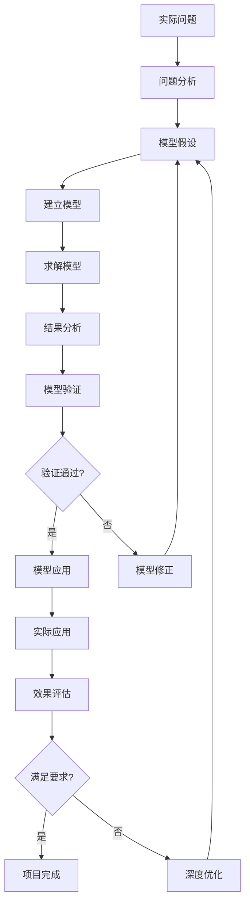

# 建模的基本流程

> "问题是数学的心脏。" 
> —— 数学家保罗·哈尔莫斯（Paul Halmos）

数学建模是一个系统化的过程，就像建造一座桥梁需要精心的设计和施工一样，成功的数学建模也需要遵循科学的步骤和方法。掌握建模的基本流程，有助于我们更好地分析和解决实际问题，避免盲目性，提高建模的成功率。

## 为什么需要标准化流程？

### 🎯 提高成功率
- 减少遗漏重要步骤的风险
- 确保每个环节都得到充分考虑
- 降低建模失败的概率

### 📊 便于团队协作
- 统一的工作语言和标准
- 明确的分工和职责划分
- 有效的进度跟踪和质量控制

### 🔄 促进经验积累
- 便于总结成功经验和失败教训
- 形成可复用的建模模板
- 培养系统化的建模思维

## 建模流程全景图

数学建模的完整流程可以用下面的流程图来表示：



这个流程体现了数学建模的三个核心特征：
- **系统性**：每个步骤都有明确的目标和任务
- **迭代性**：通过不断的修正和完善来提高模型质量
- **实用性**：最终目标是解决实际问题

## 详细步骤深度解析

### 第一步：问题分析 - 明确目标与边界

**核心目标**：深入理解实际问题的背景、要求和约束条件

#### 🔍 主要任务

**1. 明确问题目标**
- 需要解决什么问题？
- 希望达到什么效果？
- 成功的标准是什么？

**2. 理解问题背景**
- 问题产生的原因和背景
- 相关的领域知识和专业术语
- 类似问题的已有解决方案

**3. 识别相关变量**
- 哪些因素会影响问题的结果？
- 哪些变量是可控的，哪些是不可控的？
- 变量之间可能存在什么关系？

**4. 确定约束条件**
- 资源限制（时间、资金、人力）
- 技术限制（计算能力、数据获取）
- 政策法规限制

**5. 收集相关数据**
- 历史数据
- 实验数据
- 调研数据
- 专家意见

#### 💡 实战案例：校园食堂排队问题

**问题背景**：某大学食堂在用餐高峰期排队时间过长，学生抱怨较多。

**问题分析过程**：

1. **明确目标**：
   - 主要目标：减少学生排队等待时间
   - 次要目标：提高食堂服务效率
   - 成功标准：平均等待时间不超过10分钟

2. **识别变量**：
   - **输入变量**：学生到达率、服务员数量、服务速度
   - **输出变量**：排队等待时间、食堂利用率
   - **环境变量**：用餐时间分布、菜品复杂度

3. **约束条件**：
   - 食堂面积固定
   - 服务员数量有限
   - 预算限制

4. **数据收集**：
   - 不同时段的学生到达数据
   - 服务时间统计
   - 现有排队时间测量

#### ⚠️ 常见错误与避免方法

**错误1：问题定义过于宽泛**
- ❌ 错误：优化学校管理
- ✅ 正确：优化食堂排队时间

**错误2：忽略重要约束**
- ❌ 错误：只考虑数学最优解
- ✅ 正确：考虑实际实施的可行性

**错误3：数据收集不充分**
- ❌ 错误：凭经验估算关键参数
- ✅ 正确：实地测量和数据验证

### 第二步：模型假设 - 合理简化的艺术

**核心目标**：对实际问题进行合理的简化和抽象

#### 🎨 假设制定原则

**1. 简化性原则**
- 突出主要矛盾，忽略次要因素
- 抓住问题的本质特征
- 使问题变得可以处理

**2. 合理性原则**
- 符合客观实际，有科学依据
- 不违背基本的物理规律
- 得到领域专家的认可

**3. 可处理性原则**
- 便于数学建模和求解
- 在技术和计算能力范围内
- 有相应的数学工具支持

#### 📝 假设的类型和应用

**1. 独立性假设**
```
例：交通流量建模
假设：各路段的交通流量相互独立
适用：当路段间距离较远，相互影响较小时
```

**2. 线性假设**
```
例：成本分析模型
假设：总成本与产量成线性关系
适用：在一定产量范围内，边际成本相对稳定
```

**3. 均匀性假设**
```
例：人口分布模型
假设：人口在区域内均匀分布
适用：当研究区域较小，人口密度相对均匀时
```

**4. 稳定性假设**
```
例：股票价格模型
假设：股票价格波动的统计特性保持稳定
适用：在相对稳定的市场环境下
```

#### 💼 案例延续：食堂排队问题的假设

**基本假设**：
1. **到达假设**：学生到达遵循泊松分布
2. **服务假设**：服务时间遵循指数分布
3. **队列假设**：采用先到先服务(FIFO)原则
4. **容量假设**：排队空间无限大
5. **行为假设**：学生不会中途离开队列

**假设合理性分析**：
- ✅ 到达假设：符合随机到达的特点
- ✅ 服务假设：简化了复杂的服务过程
- ⚠️ 容量假设：实际中空间有限，需要后续修正
- ⚠️ 行为假设：忽略了学生的不耐烦心理

### 第三步：建立模型 - 数学语言的转换

**核心目标**：将实际问题转化为数学语言表述

#### 🔧 建模的关键要素

**1. 变量定义**
- **决策变量**：需要求解的未知量
- **状态变量**：描述系统状态的量
- **参数**：已知的常量或给定的值

**2. 关系式建立**
- **目标函数**：优化问题的目标
- **约束条件**：限制条件的数学表达
- **状态方程**：描述系统演化的方程

**3. 模型类型选择**
- **代数方程**：静态平衡问题
- **微分方程**：动态变化问题
- **优化模型**：资源配置问题
- **概率模型**：不确定性问题

#### 🎯 常用建模工具分类

**优化类模型**
```
线性规划：
minimize: c^T x
subject to: Ax ≤ b
           x ≥ 0

应用：资源分配、生产计划、运输问题
```

**微分方程类模型**
```
人口增长模型：
dP/dt = rP(1 - P/K)

应用：生物种群、经济增长、传染病传播
```

**概率统计类模型**
```
排队模型：
λ - 到达率
μ - 服务率
ρ = λ/μ - 系统利用率

应用：服务系统、通信网络、生产线
```

**图论类模型**
```
最短路径：
minimize: Σ c_{ij} x_{ij}
subject to: 流量守恒约束

应用：路径规划、网络优化、物流配送
```

#### 💼 案例延续：食堂排队的数学模型

基于前面的假设，我们可以建立M/M/s排队模型：

**变量定义**：
- λ：学生到达率（人/分钟）
- μ：单个服务员的服务率（人/分钟）
- s：服务员数量
- ρ = λ/(sμ)：系统利用率

**关键公式**：
```
平均等待时间：
W = (ρ^s / (s!(1-ρ)^2)) × (1/μ) × P₀

其中 P₀ = 1 / [Σ(k=0 to s-1) ρ^k/k! + ρ^s/(s!(1-ρ))]

目标函数：minimize W
约束条件：ρ < 1 (系统稳定性)
         s ≤ s_max (服务员数量限制)
```

### 第四步：求解模型 - 获取数学解答

**核心目标**：运用数学方法和计算工具求解模型

#### 🛠️ 求解方法分类

**1. 解析解法**
- **定义**：通过数学推导得到精确公式解
- **优势**：结果精确，便于分析
- **局限**：仅适用于简单模型
- **工具**：手工计算、符号计算软件

**适用模型示例**：
```
线性规划（2变量）：图解法
一阶线性微分方程：积分因子法
简单优化问题：拉格朗日乘数法
```

**2. 数值解法**
- **定义**：通过数值计算得到近似解
- **优势**：适用范围广，精度可控
- **局限**：计算复杂，需要编程
- **工具**：MATLAB、Python、R

**常用算法**：
```
线性方程组：高斯消元法、LU分解
非线性方程：牛顿法、二分法
微分方程：欧拉法、龙格-库塔法
优化问题：单纯形法、梯度下降法
```

**3. 仿真解法**
- **定义**：通过计算机仿真得到统计解
- **优势**：处理复杂随机系统
- **局限**：计算量大，结果有随机性
- **工具**：Arena、AnyLogic、自编程序

#### 💻 软件工具选择指南

**MATLAB**
- **优势**：数值计算强大，工具箱丰富
- **适用**：工程计算、信号处理、控制系统
- **学习曲线**：中等

**Python**
- **优势**：免费开源，库丰富，易学习
- **适用**：数据科学、机器学习、通用建模
- **推荐库**：NumPy、SciPy、SymPy、Pandas

**R语言**
- **优势**：统计分析专业，图形化好
- **适用**：统计建模、数据分析、生物信息
- **学习曲线**：易入门

**Mathematica**
- **优势**：符号计算强大，交互性好
- **适用**：理论研究、符号推导、教学
- **学习曲线**：中等偏难

#### 💼 案例延续：食堂排队问题求解

**方法选择**：由于M/M/s模型有解析解，我们选择解析解法结合数值计算。

**求解步骤**：

1. **参数估计**：
```python
# 基于收集的数据估计参数
import numpy as np
arrival_data = [45, 52, 48, 50, 47]  # 每分钟到达人数
service_data = [1.2, 1.5, 1.3, 1.4, 1.1]  # 服务时间（分钟）

lambda_rate = np.mean(arrival_data)  # 到达率
mu_rate = 1/np.mean(service_data)    # 服务率
```

2. **模型计算**：
```python
def calculate_waiting_time(lambda_rate, mu_rate, servers):
    rho = lambda_rate / (servers * mu_rate)
    if rho >= 1:
        return float('inf')  # 系统不稳定
    
    # 计算P0
    p0_denominator = 0
    for k in range(servers):
        p0_denominator += (rho * servers)**k / math.factorial(k)
    p0_denominator += (rho * servers)**servers / (math.factorial(servers) * (1 - rho))
    p0 = 1 / p0_denominator
    
    # 计算平均等待时间
    waiting_time = (rho**servers / (math.factorial(servers) * (1-rho)**2)) * (1/mu_rate) * p0
    return waiting_time
```

3. **优化求解**：
```python
# 寻找最优服务员数量
min_servers = 1
max_servers = 10
target_waiting_time = 10  # 分钟

for s in range(min_servers, max_servers + 1):
    wt = calculate_waiting_time(lambda_rate, mu_rate, s)
    print(f"服务员数量: {s}, 等待时间: {wt:.2f} 分钟")
    if wt <= target_waiting_time:
        optimal_servers = s
        break
```

### 第五步：结果分析 - 深度解读数学解答

**核心目标**：对求解结果进行数学分析和物理意义解释

#### 🔍 分析维度

**1. 数学分析**
- **解的存在性**：问题是否有解？
- **解的唯一性**：解是否唯一？
- **解的稳定性**：小的扰动是否影响解？
- **解的收敛性**：数值解是否收敛？

**2. 敏感性分析**
- **参数敏感性**：参数变化对结果的影响程度
- **关键参数识别**：哪些参数对结果影响最大？
- **鲁棒性评估**：模型对参数误差的容忍程度

**3. 物理意义解释**
- **结果合理性**：是否符合常识和经验？
- **极限情况验证**：特殊情况下结果是否正确？
- **量纲一致性**：单位是否正确？

#### 📊 敏感性分析方法

**1. 单因素敏感性分析**
```python
# 分析到达率变化的影响
lambda_values = np.linspace(40, 60, 21)
waiting_times = []

for lam in lambda_values:
    wt = calculate_waiting_time(lam, mu_rate, optimal_servers)
    waiting_times.append(wt)

# 绘制敏感性图
plt.plot(lambda_values, waiting_times)
plt.xlabel('到达率 (人/分钟)')
plt.ylabel('等待时间 (分钟)')
plt.title('等待时间对到达率的敏感性')
```

**2. 蒙特卡罗敏感性分析**
```python
# 考虑参数的不确定性
n_simulations = 1000
results = []

for i in range(n_simulations):
    # 参数加入随机扰动
    lambda_sim = np.random.normal(lambda_rate, lambda_rate * 0.1)
    mu_sim = np.random.normal(mu_rate, mu_rate * 0.1)
    
    wt = calculate_waiting_time(lambda_sim, mu_sim, optimal_servers)
    results.append(wt)

# 统计分析
mean_wt = np.mean(results)
std_wt = np.std(results)
confidence_interval = np.percentile(results, [5, 95])
```

#### 💼 案例延续：食堂排队结果分析

**数学分析结果**：
- 当服务员数量为5人时，平均等待时间为8.5分钟
- 系统利用率为0.82，处于合理范围
- 解的存在性和唯一性得到保证

**敏感性分析发现**：
- 等待时间对到达率高度敏感
- 服务率提高10%可减少等待时间15%
- 增加一个服务员比提高服务速度更有效

**物理意义解释**：
- 结果符合排队论的基本规律
- 与实际观察的现象一致
- 为管理决策提供了量化依据

### 第六步：模型验证 - 检验模型的可靠性

**核心目标**：检验模型的正确性和适用性

#### ✅ 验证方法体系

**1. 直观验证**
- **常识检验**：结果是否符合常识？
- **专家判断**：领域专家是否认可？
- **经验对比**：与以往经验是否一致？

**2. 数据验证**
- **回代验证**：用原始数据检验模型
- **留一验证**：留出部分数据进行测试
- **交叉验证**：多组数据交叉检验

**3. 理论验证**
- **量纲验证**：检查量纲是否正确
- **极限验证**：极限情况下结果是否合理
- **对称性验证**：模型是否满足应有的对称性

**4. 统计验证**
- **假设检验**：模型假设是否成立
- **拟合优度**：模型与数据的吻合程度
- **残差分析**：误差是否符合假设

#### 🎯 验证实施步骤

**步骤1：制定验证计划**
```
验证目标：确认模型预测精度
验证数据：最近一周的实际观测数据
验证指标：平均绝对误差(MAE)、均方根误差(RMSE)
通过标准：MAE < 2分钟，RMSE < 3分钟
```

**步骤2：数据收集与预处理**
```python
# 收集验证数据
validation_data = {
    'time_period': ['11:30-12:00', '12:00-12:30', '12:30-13:00'],
    'actual_waiting_time': [9.2, 10.5, 7.8],
    'arrival_rate': [48, 52, 45],
    'servers': [5, 5, 5]
}
```

**步骤3：模型预测**
```python
predicted_times = []
for i in range(len(validation_data['time_period'])):
    arrival_rate = validation_data['arrival_rate'][i]
    servers = validation_data['servers'][i]
    predicted_wt = calculate_waiting_time(arrival_rate, mu_rate, servers)
    predicted_times.append(predicted_wt)
```

**步骤4：误差分析**
```python
import numpy as np
from sklearn.metrics import mean_absolute_error, mean_squared_error

actual = validation_data['actual_waiting_time']
predicted = predicted_times

mae = mean_absolute_error(actual, predicted)
rmse = np.sqrt(mean_squared_error(actual, predicted))
mape = np.mean(np.abs((actual - predicted) / actual)) * 100

print(f"平均绝对误差: {mae:.2f} 分钟")
print(f"均方根误差: {rmse:.2f} 分钟")
print(f"平均绝对百分比误差: {mape:.1f}%")
```

#### ⚠️ 验证中的常见问题

**问题1：过拟合**
- **现象**：训练数据拟合很好，但验证数据误差大
- **原因**：模型过于复杂，记住了数据的噪声
- **解决**：简化模型，增加验证数据

**问题2：欠拟合**
- **现象**：训练和验证数据误差都很大
- **原因**：模型过于简单，无法捕捉数据特征
- **解决**：增加模型复杂度，考虑更多因素

**问题3：数据偏差**
- **现象**：验证在某些条件下失效
- **原因**：验证数据不能代表所有情况
- **解决**：扩大验证数据范围，考虑各种场景

### 第七步：模型修正 - 持续改进与优化

**核心目标**：根据验证结果改进模型

#### 🔄 修正策略

**1. 假设调整**
- 放松过于严格的假设
- 增加被忽略的重要因素
- 改进不合理的简化

**2. 结构优化**
- 改变数学表达形式
- 采用更合适的模型类型
- 调整模型的复杂度

**3. 参数校正**
- 重新估计模型参数
- 增加参数的个数
- 考虑参数的时变性

**4. 数据完善**
- 收集更多数据
- 提高数据质量
- 扩大数据覆盖范围

#### 💼 案例延续：食堂排队模型的修正

**验证发现的问题**：
1. 高峰期预测误差较大
2. 忽略了学生的不耐烦行为
3. 服务时间分布不符合指数分布

**修正方案**：

**修正1：考虑时变到达率**
```python
# 原模型：常数到达率
# 修正后：时间相关的到达率
def time_dependent_arrival_rate(t):
    """
    t: 时间（小时）
    返回该时刻的到达率
    """
    if 11.5 <= t <= 12.5:  # 高峰期
        return 55
    elif 12.5 <= t <= 13.0:  # 次高峰
        return 45
    else:
        return 30
```

**修正2：加入不耐烦模型**
```python
# 考虑学生离开队列的行为
def impatient_queue_model(lambda_rate, mu_rate, servers, theta):
    """
    theta: 不耐烦率，学生离开队列的概率
    """
    # 修正的M/M/s/K模型
    effective_lambda = lambda_rate * (1 - theta)
    return calculate_waiting_time(effective_lambda, mu_rate, servers)
```

**修正3：使用更合适的服务时间分布**
```python
# 从指数分布改为伽马分布
import scipy.stats as stats

def gamma_service_model(lambda_rate, shape, scale, servers):
    """
    shape, scale: 伽马分布参数
    """
    mean_service_time = shape * scale
    mu_rate = 1 / mean_service_time
    cv_squared = 1 / shape  # 变异系数平方
    
    # 使用Pollaczek-Khinchine公式修正
    correction_factor = (1 + cv_squared) / 2
    
    return calculate_waiting_time(lambda_rate, mu_rate, servers) * correction_factor
```

### 第八步：模型应用 - 实践中创造价值

**核心目标**：将模型用于解决实际问题

#### 🎯 应用形式

**1. 预测分析**
- 趋势预测
- 风险评估
- 场景分析

**2. 优化设计**
- 参数优化
- 结构设计
- 策略制定

**3. 决策支持**
- 方案比较
- 效果评估
- 投资分析

**4. 实时控制**
- 自适应调节
- 反馈控制
- 智能调度

#### 💼 案例延续：食堂排队优化方案

**基于模型的管理建议**：

**1. 动态服务员调度**
```python
def optimal_staffing_schedule():
    time_slots = [
        (11:00-11:30, 3),  # 3名服务员
        (11:30-12:00, 5),  # 5名服务员
        (12:00-12:30, 6),  # 6名服务员  
        (12:30-13:00, 4),  # 4名服务员
        (13:00-13:30, 3)   # 3名服务员
    ]
    return time_slots
```

**2. 预约系统设计**
```python
def reservation_system(total_capacity, time_slot_duration=30):
    """
    设计预约系统，平滑用餐高峰
    """
    max_reservations_per_slot = int(total_capacity * 0.7)  # 70%预约，30%现场
    
    time_slots = [
        "11:00-11:30", "11:30-12:00", 
        "12:00-12:30", "12:30-13:00", "13:00-13:30"
    ]
    
    return {slot: max_reservations_per_slot for slot in time_slots}
```

**3. 实时监控系统**
```python
def real_time_monitoring():
    """
    实时监控排队状况，动态调整
    """
    current_queue_length = get_current_queue_length()
    current_waiting_time = estimate_waiting_time(current_queue_length)
    
    if current_waiting_time > 10:  # 超过目标等待时间
        alert_management()
        suggest_additional_staff()
    
    return {
        'queue_length': current_queue_length,
        'estimated_waiting': current_waiting_time,
        'recommendation': get_recommendation()
    }
```

## 建模流程的高阶特征

### 1. 迭代性：螺旋式上升的过程

**特点说明**：
- 建模不是线性过程，而是螺旋式上升
- 每次迭代都会加深对问题的理解
- 模型质量在迭代中不断提升

**迭代策略**：
```
第一轮迭代：建立最简单的基础模型
第二轮迭代：增加重要因素，提高精度
第三轮迭代：考虑特殊情况，增强鲁棒性
第四轮迭代：优化计算效率，便于实用
```

**迭代管理**：
- 设定迭代目标和终止条件
- 记录每次迭代的改进点
- 评估迭代的成本效益

### 2. 创造性：艺术与科学的结合

**创新点**：
- **问题视角**：从新角度理解问题
- **方法选择**：创新性地组合数学工具
- **假设设计**：巧妙的简化和抽象
- **解法创新**：开发新的求解算法

**培养创造性的方法**：
- 广泛学习不同领域的建模方法
- 多角度思考同一个问题
- 勇于尝试非常规的方法
- 从失败中学习和改进

### 3. 综合性：多学科知识的融合

**涉及的知识体系**：

**数学基础**
- 微积分：处理连续变化
- 线性代数：多变量系统
- 概率统计：不确定性处理
- 离散数学：组合优化问题

**专业领域知识**
- 物理学：力学、热学、电学原理
- 经济学：市场规律、行为理论
- 工程学：系统分析、控制理论
- 生物学：生态系统、进化规律

**计算技术**
- 编程语言：Python、MATLAB、R
- 数值方法：有限元、有限差分
- 机器学习：回归、分类、聚类
- 仿真技术：蒙特卡罗、系统动力学

**软技能**
- 团队协作：分工合作、沟通协调
- 项目管理：进度控制、质量保证
- 文档写作：清晰表达、逻辑严密
- 演示技巧：有效展示、说服他人

## 建模实践技巧与最佳实践

### 💡 建模技巧

**1. 由简到繁：渐进式建模**

**策略说明**：
- 先建立最简单的模型
- 逐步增加复杂因素
- 在每个阶段都验证模型有效性

**实施步骤**：
```
步骤1：建立线性模型（假设变量间线性关系）
步骤2：引入非线性因素（考虑平方项、交互项）
步骤3：加入随机因素（考虑噪声和不确定性）
步骤4：考虑动态因素（时间变化、演化过程）
```

**案例：需求预测模型**
```python
# 第一版：线性回归
def simple_demand_model(price):
    return 1000 - 10 * price

# 第二版：考虑价格弹性
def elastic_demand_model(price, income):
    return 1000 * (income/50000)**0.5 - 10 * price

# 第三版：加入季节性
def seasonal_demand_model(price, income, month):
    seasonal_factor = 1 + 0.2 * math.sin(2 * math.pi * month / 12)
    base_demand = 1000 * (income/50000)**0.5 - 10 * price
    return base_demand * seasonal_factor
```

**2. 类比和借鉴：站在巨人的肩膀上**

**经典模型库**：
- **增长模型**：指数增长、Logistic增长、Gompertz增长
- **扩散模型**：Bass模型、传染病模型、创新扩散
- **竞争模型**：Lotka-Volterra、博弈论模型
- **优化模型**：线性规划、整数规划、动态规划

**借鉴策略**：
```python
# 示例：从生物学模型借鉴到经济学
# 原模型：种群竞争模型
def population_competition(x, y, t):
    dx_dt = r1 * x * (1 - (x + a12*y)/K1)
    dy_dt = r2 * y * (1 - (y + a21*x)/K2)
    return dx_dt, dy_dt

# 借鉴应用：市场竞争模型
def market_competition(market_share_a, market_share_b, t):
    # x, y -> 市场份额
    # r1, r2 -> 增长率
    # K1, K2 -> 市场容量
    # a12, a21 -> 竞争强度
    return population_competition(market_share_a, market_share_b, t)
```

**3. 分解和组合：化整为零，合零为整**

**分解策略**：
- **功能分解**：按功能模块划分
- **时间分解**：按时间阶段分解
- **空间分解**：按地理区域分解
- **层次分解**：按决策层次分解

**组合方法**：
```python
# 示例：供应链建模的分解组合
class SupplyChainModel:
    def __init__(self):
        self.supplier_model = SupplierModel()
        self.manufacturer_model = ManufacturerModel()
        self.distributor_model = DistributorModel()
        self.retailer_model = RetailerModel()
    
    def integrate_models(self):
        # 模型间的信息传递和协调
        supply_output = self.supplier_model.produce()
        manufacturing_output = self.manufacturer_model.process(supply_output)
        distribution_output = self.distributor_model.distribute(manufacturing_output)
        final_output = self.retailer_model.sell(distribution_output)
        
        return final_output
```

### 🏆 最佳实践

**1. 文档化管理**

**建模日志**：
```markdown
# 建模日志模板

## 项目信息
- 项目名称：[项目名称]
- 建模日期：[开始日期] - [结束日期]
- 团队成员：[成员列表]
- 项目目标：[具体目标描述]

## 问题分析
- 问题背景：[详细背景]
- 关键变量：[变量列表及说明]
- 约束条件：[约束条件描述]
- 数据来源：[数据收集情况]

## 模型设计
- 建模假设：[假设列表及合理性分析]
- 模型类型：[选择的模型类型及原因]
- 数学表达：[关键公式和方程]

## 求解过程
- 求解方法：[选择的求解方法]
- 软件工具：[使用的软件及版本]
- 计算结果：[主要结果汇总]

## 验证与分析
- 验证方法：[验证策略]
- 验证结果：[验证通过情况]
- 敏感性分析：[关键发现]

## 应用与建议
- 主要结论：[核心发现]
- 实施建议：[具体建议]
- 局限性：[模型局限性说明]
- 改进方向：[未来改进建议]
```

**2. 版本控制**

**模型版本管理**：
```python
class ModelVersionControl:
    def __init__(self, model_name):
        self.model_name = model_name
        self.versions = {}
        self.current_version = "1.0"
    
    def save_version(self, version_number, model, description):
        self.versions[version_number] = {
            'model': model,
            'description': description,
            'timestamp': datetime.now(),
            'performance': None
        }
    
    def compare_versions(self, v1, v2):
        """比较不同版本的性能"""
        performance_v1 = self.versions[v1]['performance']
        performance_v2 = self.versions[v2]['performance']
        return {
            'accuracy_improvement': performance_v2['accuracy'] - performance_v1['accuracy'],
            'speed_improvement': performance_v1['runtime'] - performance_v2['runtime']
        }
```

**3. 团队协作**

**角色分工**：
```
项目经理：整体协调、进度控制、资源配置
数学建模师：模型设计、数学推导、方法选择
数据分析师：数据收集、清洗、特征工程
程序开发师：代码实现、算法优化、系统集成
领域专家：提供专业知识、验证模型合理性
```

**协作工具**：
- **代码协作**：Git、GitHub、GitLab
- **文档共享**：Google Docs、Notion、Confluence
- **项目管理**：Trello、Asana、Jira
- **沟通工具**：Slack、微信群、腾讯会议

**4. 质量保证**

**质量检查清单**：
```markdown
## 建模质量检查清单

### 问题分析阶段
- [ ] 问题定义清晰明确
- [ ] 目标可量化可衡量
- [ ] 约束条件完整合理
- [ ] 数据来源可靠充分

### 模型建立阶段
- [ ] 假设合理且有依据
- [ ] 变量定义清晰准确
- [ ] 数学表达正确无误
- [ ] 模型结构逻辑清晰

### 求解验证阶段
- [ ] 求解方法选择合适
- [ ] 计算结果正确可信
- [ ] 验证方法全面有效
- [ ] 敏感性分析充分

### 应用推广阶段
- [ ] 结果解释清晰准确
- [ ] 建议具体可操作
- [ ] 局限性说明充分
- [ ] 文档完整规范
```

## 常见错误分析与避免策略

### ❌ 典型错误

**1. 问题定义错误**
- **错误表现**：解决了错误的问题
- **根本原因**：没有深入理解真正的需求
- **避免策略**：多轮沟通确认，明确成功标准

**2. 假设不合理**
- **错误表现**：假设与实际严重不符
- **根本原因**：缺乏领域知识，盲目简化
- **避免策略**：咨询领域专家，验证假设合理性

**3. 模型过度复杂**
- **错误表现**：模型无法求解或理解
- **根本原因**：追求完美，不敢简化
- **避免策略**：遵循奥卡姆剃刀原则，从简单开始

**4. 验证不充分**
- **错误表现**：模型在新数据上表现差
- **根本原因**：只在训练数据上验证
- **避免策略**：多种验证方法结合，使用独立数据集

### ✅ 成功要素

**1. 深度理解问题**
- 与利益相关者充分沟通
- 实地调研，了解实际情况
- 明确约束条件和成功标准

**2. 合理的建模假设**
- 基于科学原理和经验
- 咨询领域专家意见
- 定期检验和调整假设

**3. 系统化的建模流程**
- 遵循标准化流程
- 每个步骤都有明确交付物
- 建立质量检查机制

**4. 持续的验证和改进**
- 多方面验证模型有效性
- 根据反馈持续改进
- 建立长期监控机制

## 学习建议与提升路径

### 📚 基础能力建设

**数学基础**
- **微积分**：掌握导数、积分、多元函数
- **线性代数**：矩阵运算、特征值、线性变换
- **概率统计**：概率分布、假设检验、回归分析
- **离散数学**：图论、组合数学、算法复杂度

**编程技能**
- **Python**：NumPy、SciPy、Pandas、Matplotlib
- **R语言**：统计分析、数据可视化
- **MATLAB**：数值计算、工程应用
- **SQL**：数据查询、数据库操作

### 🎯 专业技能提升

**建模方法**
- **优化理论**：线性规划、非线性规划、动态规划
- **统计学习**：回归分析、分类、聚类、时间序列
- **仿真建模**：蒙特卡罗、离散事件仿真、系统动力学
- **机器学习**：监督学习、无监督学习、强化学习

**应用领域**
- 选择1-2个感兴趣的应用领域深入学习
- 了解该领域的典型问题和解决方案
- 掌握领域特有的建模方法和工具

### 🚀 实践经验积累

**项目实践**
- 参与实际的建模项目
- 从简单问题开始，逐步处理复杂问题
- 完整经历建模流程的每个步骤

**竞赛参与**
- **数学建模竞赛**：美赛、国赛、研究生数学建模竞赛
- **数据科学竞赛**：Kaggle、天池、DataCastle
- **算法竞赛**：ACM、蓝桥杯、算法竞赛

**学习交流**
- 加入建模社区和论坛
- 参加学术会议和研讨会
- 与其他建模者交流经验

## 小结与展望

数学建模的基本流程为我们提供了系统化的问题解决框架。这个流程不是僵化的步骤，而是灵活的指导原则。在实际应用中，我们需要根据具体问题的特点，灵活调整和优化这个流程。

### 🎯 关键要点回顾

1. **流程的系统性**：八个步骤环环相扣，缺一不可
2. **过程的迭代性**：通过不断循环来提高模型质量
3. **方法的综合性**：需要数学、计算机、专业领域的综合知识
4. **实践的重要性**：只有在实际应用中才能真正掌握

### 🔮 未来发展趋势

**智能化建模**
- AI辅助的自动建模
- 智能假设生成和验证
- 自适应模型优化

**云端协作**
- 云端建模平台
- 分布式计算资源
- 在线协作工具

**跨界融合**
- 与机器学习的深度融合
- 与物联网的结合应用
- 与区块链的创新结合

掌握建模流程的关键在于：

1. **理解每个步骤的核心目标和方法**
2. **培养系统化的思维方式**
3. **在实践中不断积累经验**
4. **保持学习和创新的精神**

在下一节中，我们将探讨数学建模的广泛应用和深远意义，了解数学建模如何在各个领域发挥重要作用，以及它对我们个人和社会发展的价值。

**记住**：好的建模流程是成功的一半，但另一半来自于你的知识积累、实践经验和创新思维。让我们在遵循规范流程的基础上，勇于探索和创新，用数学建模的力量去解决更多有意义的问题！
