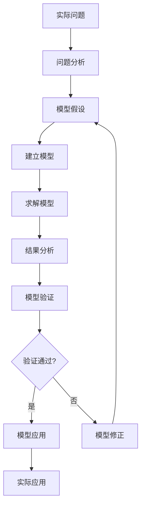

# 1.2 建模的基本流程

数学建模是一个系统化的过程，需要遵循一定的步骤和方法。掌握建模的基本流程，有助于我们更好地分析和解决实际问题。

## 建模流程图

## 详细步骤

### 第一步：问题分析
**目标**：深入理解实际问题的背景、要求和约束条件

**主要任务**：
- 明确问题的目标和要求
- 分析问题的背景和重要性
- 识别相关的变量和参数
- 确定约束条件和边界条件
- 收集相关数据和信息

**注意事项**：
- 要深入了解问题的实际背景
- 与领域专家充分沟通
- 明确哪些是已知条件，哪些是求解目标

### 第二步：模型假设
**目标**：对实际问题进行合理的简化和抽象

**主要内容**：
- 确定主要因素和次要因素
- 对复杂现象进行合理简化
- 明确模型的适用范围和条件
- 确定变量之间的关系

**假设原则**：
- **简化性**：突出主要矛盾，忽略次要因素
- **合理性**：符合实际情况，有科学依据
- **可处理性**：便于数学处理和求解

**常见假设类型**：
- 独立性假设：忽略某些相互影响
- 线性假设：将非线性关系线性化
- 均匀性假设：假设某些量在空间或时间上均匀分布
- 稳定性假设：忽略随机波动，考虑稳定状态

### 第三步：建立模型
**目标**：将实际问题转化为数学语言表述

**主要任务**：
- 定义变量和参数
- 建立数学关系式
- 确定目标函数（如果是优化问题）
- 列出约束条件

**常用数学工具**：
- **代数方程**：线性方程组、非线性方程
- **微分方程**：常微分方程、偏微分方程
- **优化模型**：线性规划、非线性规划
- **概率模型**：随机过程、统计模型
- **图论模型**：网络、路径问题

### 第四步：求解模型
**目标**：运用数学方法和计算工具求解模型

**求解方法**：
- **解析解法**：直接求出精确解
- **数值解法**：通过数值计算得到近似解
- **近似解法**：通过近似方法得到简化解

**常用工具**：
- 数学软件：MATLAB、Mathematica、Maple
- 统计软件：R、SPSS、SAS
- 编程语言：Python、C++、Java
- 专业软件：根据具体问题选择

### 第五步：结果分析
**目标**：对求解结果进行数学分析和物理意义解释

**分析内容**：
- **数学分析**：解的存在性、唯一性、稳定性
- **敏感性分析**：参数变化对结果的影响
- **物理意义**：结果是否符合实际情况
- **极限情况**：特殊情况下的结果

### 第六步：模型验证
**目标**：检验模型的正确性和适用性

**验证方法**：
1. **直观验证**：结果是否合理，是否符合常识
2. **数据验证**：用实际数据检验模型预测
3. **极限验证**：检验极限情况下的结果
4. **量纲验证**：检查量纲是否正确
5. **对比验证**：与已知结果或其他模型对比

### 第七步：模型修正（如需要）
**目标**：根据验证结果改进模型

**修正策略**：
- 调整假设条件
- 增加或删除某些因素
- 改变数学表达形式
- 重新收集数据

### 第八步：模型应用
**目标**：将模型用于解决实际问题

**应用形式**：
- 数值计算和预测
- 优化方案设计
- 决策支持
- 科学研究

## 建模流程的特点

### 1. 迭代性
建模是一个反复修正、逐步完善的过程：
- 很少一次就能建立完美的模型
- 需要根据验证结果不断改进
- 每次迭代都会加深对问题的理解

### 2. 创造性
建模过程需要创新思维：
- 没有固定的模式和方法
- 需要灵活运用各种数学工具
- 要敢于尝试新的方法和思路

### 3. 综合性
建模涉及多个方面的知识：
- 数学理论和方法
- 相关领域的专业知识
- 计算机技术和软件使用
- 沟通交流和团队合作

## 建模技巧

### 1. 由简到繁
- 先建立简单模型，再逐步完善
- 先考虑理想情况，再加入实际约束
- 先解决主要问题，再处理次要问题

### 2. 类比和借鉴
- 学习和借鉴已有的经典模型
- 寻找类似问题的解决方案
- 运用物理、化学等学科的规律

### 3. 分解和组合
- 将复杂问题分解为简单子问题
- 先解决各个子问题，再综合考虑
- 用系统的观点处理整体问题

## 小结

数学建模的基本流程为我们提供了系统化的问题解决框架。虽然不同类型的问题可能在具体步骤上有所差异，但这个基本流程是普遍适用的。

掌握建模流程的关键在于：
- 深入理解每个步骤的目标和要求
- 熟练运用各种数学工具和方法
- 培养分析问题和解决问题的能力
- 在实践中不断积累经验和技巧

在后续的学习中，我们将通过具体的案例来演示这个建模流程的应用。
