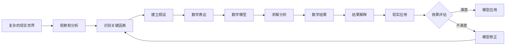

# 什么是数学建模

> "本质上，所有的模型都是错误的，但有些是有用的。" 
> —— 统计学家乔治·博克斯（George Box）

## 从一个故事开始

想象一下，你是一名城市规划师，需要为一个新建的商业区设计停车场。你面临的问题是：应该建造多少个停车位才能既满足顾客需求，又不造成资源浪费？

这看起来是个简单的问题，但实际上涉及很多因素：
- 商业区的规模和类型
- 预期的顾客流量
- 顾客的停车时长
- 高峰期和平常时间的差异
- 周末和工作日的差异

如果你试图考虑所有可能的因素，问题就会变得极其复杂。但是，如果你能够识别出最重要的因素，建立一个数学关系来描述停车需求与这些因素的关系，你就在进行数学建模了。

这就是数学建模的魅力所在：**它让我们能够在复杂的现实世界中找到简洁而有效的解决方案。**

## 定义与内涵

### 核心定义

**数学建模**（Mathematical Modeling）是运用数学理论、方法和工具，通过抽象、简化、假设等手段，将实际问题转化为数学问题，并求解该数学问题，从而为原实际问题提供定量化分析、预测和优化方案的过程。

### 深层内涵

数学建模不仅仅是一种技术方法，更是一种：

**🧠 思维方式**
- 用数学的眼光观察世界
- 寻找现象背后的数量关系和规律
- 将复杂问题简化为可处理的数学问题

**🔬 科学方法**
- 基于假设和逻辑推理
- 通过数据验证和模型检验
- 不断迭代和优化改进

**🛠️ 实用工具**
- 连接理论与实践的桥梁
- 解决实际问题的有效手段
- 支持决策的科学依据

## 核心要素分析

### 1. 实际问题：建模的源泉

**特点**：
- **复杂性**：涉及多个变量和因素
- **不确定性**：存在随机性和模糊性
- **多样性**：来源于各个不同领域
- **实用性**：有明确的解决需求

**示例**：
- 📈 **经济问题**：股票价格预测、市场需求分析
- 🚗 **交通问题**：路线优化、交通流量控制
- 🏥 **医学问题**：药物剂量计算、疾病传播预测
- 🌍 **环境问题**：污染扩散、生态系统平衡

### 2. 数学方法：建模的工具

#### 基础数学工具
- **代数**：方程组、不等式
- **几何**：空间关系、图形变换
- **微积分**：变化率、优化问题
- **概率统计**：不确定性、数据分析

#### 高级数学工具
- **微分方程**：动态系统建模
- **线性代数**：多变量系统
- **数值分析**：计算方法
- **运筹学**：优化理论

#### 现代计算工具
- **计算机仿真**：复杂系统模拟
- **机器学习**：数据驱动建模
- **人工智能**：智能优化算法

### 3. 数学模型：建模的成果

**数学模型的表现形式**：

1. **方程和方程组**
   ```
   例：人口增长模型
   dP/dt = rP(1 - P/K)
   其中：P(t) - 时刻t的人口数量
        r - 内在增长率
        K - 环境容纳量
   ```

2. **函数关系**
   ```
   例：需求-价格关系
   Q = a - bp
   其中：Q - 需求量，p - 价格
        a, b - 待定参数
   ```

3. **优化模型**
   ```
   例：资源分配问题
   max f(x₁, x₂, ..., xₙ)
   subject to: g₁(x₁, x₂, ..., xₙ) ≤ 0
              g₂(x₁, x₂, ..., xₙ) ≤ 0
              ...
   ```

4. **图论模型**
   - 网络流量分析
   - 最短路径问题
   - 社交网络分析

## 建模的本质：抽象化艺术

数学建模的本质是一个**抽象化**过程，这个过程可以用以下流程图来表示：



这个过程包含三个关键的转化：

### 1. 现实问题 → 数学问题
**挑战**：如何在保持问题本质的同时进行合理简化？

**策略**：
- 识别核心变量和关键关系
- 制定合理的假设条件
- 选择适当的数学工具

**案例**：疫情传播建模
- **现实问题**：COVID-19在人群中的传播
- **关键简化**：将人群分为易感者(S)、感染者(I)、康复者(R)
- **数学表达**：SIR微分方程组
  ```
  dS/dt = -βSI/N
  dI/dt = βSI/N - γI  
  dR/dt = γI
  ```

### 2. 数学求解 → 数学结果
**挑战**：如何选择合适的求解方法？

**方法分类**：
- **解析解法**：直接求出精确公式解
- **数值解法**：通过计算机得到近似数值解
- **近似解法**：通过数学技巧得到近似解

### 3. 数学结果 → 现实意义
**挑战**：如何正确解释数学结果的现实含义？

**注意事项**：
- 考虑模型的假设和局限性
- 分析结果的合理性和可信度
- 提供决策建议和实施方案

## 数学模型的基本特点

### 1. 简化性：化繁为简的智慧

**含义**：突出主要因素，忽略次要因素

**实例**：自由落体模型
- **忽略因素**：空气阻力、地球自转、物体形状
- **保留因素**：重力加速度、初始条件
- **模型公式**：h = h₀ + v₀t - ½gt²

**优势**：
- 使复杂问题变得可处理
- 便于数学分析和计算
- 易于理解和应用

**风险**：
- 可能丢失重要信息
- 适用范围有限
- 需要谨慎验证

### 2. 近似性：精确与实用的平衡

**含义**：模型是对现实的近似描述，而非完全复制

**体现**：
- **量化近似**：将连续变量离散化
- **关系近似**：用线性关系近似非线性关系
- **参数近似**：用常数近似变量

**经典案例**：牛顿万有引力定律
- 在日常尺度下高度精确
- 在极高速度下需要相对论修正
- 在量子尺度下需要量子力学描述

### 3. 阶段性：渐进发展的过程

**含义**：模型的发展是一个渐进的过程

**表现**：
- 从简单到复杂
- 从静态到动态
- 从确定到随机

**演进示例**：天体运动模型
1. **古代**：天圆地方模型
2. **中世纪**：地心说模型
3. **近代**：日心说模型
4. **现代**：相对论时空模型

## 模型分类体系

### 按确定性分类

#### 1. 确定性模型 (Deterministic Models)
**特点**：给定输入，输出唯一确定

**适用场景**：
- 物理规律明确的问题
- 环境条件稳定的情况
- 精确控制的实验

**典型例子**：
- 牛顿运动定律
- 电路欧姆定律
- 化学反应方程

#### 2. 随机性模型 (Stochastic Models)
**特点**：考虑随机因素和不确定性

**适用场景**：
- 含有随机扰动的系统
- 信息不完全的情况
- 大量个体行为的集合

**典型例子**：
- 股票价格波动模型
- 排队服务系统
- 生物种群动态

### 按时间性分类

#### 1. 静态模型 (Static Models)
**特点**：不考虑时间变化，描述某一时刻的状态

**数学形式**：代数方程、优化问题

**应用实例**：
```
供需平衡模型：
供给：Qs = a + bp
需求：Qd = c - dp
平衡：Qs = Qd
```

#### 2. 动态模型 (Dynamic Models)
**特点**：考虑时间演化，描述系统的变化过程

**数学形式**：微分方程、差分方程

**应用实例**：
```
捕食者-被捕食者模型：
dx/dt = ax - bxy
dy/dt = -cy + dxy
其中 x - 被捕食者数量，y - 捕食者数量
```

### 按变量类型分类

#### 1. 连续模型 (Continuous Models)
**特点**：变量可以连续变化

**数学工具**：微积分、微分方程

**典型应用**：
- 流体力学
- 传热传质
- 电磁场理论

#### 2. 离散模型 (Discrete Models)  
**特点**：变量取离散值

**数学工具**：差分方程、图论、组合数学

**典型应用**：
- 计算机网络
- 供应链管理
- 排班调度

### 按建模方法分类

#### 1. 机理建模 (Mechanistic Modeling)
**基础**：基于对象的内在规律和物理机制

**优势**：
- 物理意义明确
- 可解释性强
- 适用范围广

**局限**：
- 需要深入了解机理
- 复杂系统难以建模

**示例**：牛顿第二定律 F = ma

#### 2. 统计建模 (Statistical Modeling)
**基础**：基于数据的统计分析和相关关系

**优势**：
- 不需要了解详细机理
- 适合大数据分析
- 预测精度高

**局限**：
- 缺乏物理解释
- 依赖数据质量
- 外推能力有限

**示例**：线性回归模型 y = β₀ + β₁x + ε

#### 3. 仿真建模 (Simulation Modeling)
**基础**：基于计算机仿真技术

**优势**：
- 可处理复杂系统
- 便于进行实验
- 风险成本低

**局限**：
- 计算资源需求大
- 结果依赖于假设
- 难以优化

**示例**：蒙特卡罗模拟

## 数学建模的重要意义

### 1. 理论价值：推动科学发展

**促进数学发展**：
- 应用需求推动理论创新
- 实际问题启发新的数学分支
- 计算需求促进算法发展

**历史案例**：
- **微积分**：源于天体力学和物理学问题
- **概率论**：源于赌博问题和保险问题
- **线性规划**：源于军事物资调配问题

**跨学科融合**：
- 数学与物理、化学、生物的结合
- 计算机科学与传统数学的融合
- 人工智能与数学建模的结合

### 2. 实践价值：解决现实问题

**提高效率**：
- 优化生产流程
- 合理配置资源
- 减少试错成本

**支持决策**：
- 提供定量依据
- 评估不同方案
- 预测发展趋势

**创新驱动**：
- 设计新产品
- 发现新规律
- 开拓新领域

### 3. 教育价值：培养综合能力

**思维能力**：
- 抽象思维
- 逻辑推理
- 系统思考

**实践能力**：
- 问题分析
- 方案设计
- 结果评估

**综合素质**：
- 团队协作
- 沟通表达
- 创新精神

## 经典建模案例分析

### 案例1：开普勒行星运动定律

**背景**：16-17世纪，天文学家开普勒通过分析第谷的观测数据，发现了行星运动的规律。

**建模过程**：
1. **观察**：行星位置的精确观测数据
2. **假设**：行星绕太阳运动，轨道为椭圆
3. **数学表达**：
   - 第一定律：行星轨道是椭圆，太阳位于焦点
   - 第二定律：行星与太阳的连线在相等时间内扫过相等面积
   - 第三定律：轨道周期的平方与半长轴的立方成正比

**意义**：这是数学建模的早期典范，展现了数学在揭示自然规律中的威力。

### 案例2：马尔萨斯人口模型

**背景**：18世纪末，经济学家马尔萨斯研究人口增长问题。

**模型假设**：
- 人口增长率与当前人口数成正比
- 不考虑资源限制等因素

**数学表达**：
```
dP/dt = rP
解得：P(t) = P₀e^(rt)
```

**模型特点**：
- 简单明了，易于理解
- 短期预测较准确
- 长期预测过于乐观

**改进方向**：考虑环境容纳量限制，发展为Logistic模型

### 案例3：Black-Scholes期权定价模型

**背景**：1973年，布莱克和肖尔斯建立了期权定价的数学模型。

**关键假设**：
- 股票价格遵循几何布朗运动
- 无风险利率恒定
- 没有交易成本和税收

**数学模型**：
```
Black-Scholes偏微分方程：
∂V/∂t + ½σ²S²∂²V/∂S² + rS∂V/∂S - rV = 0
```

**历史意义**：
- 获得1997年诺贝尔经济学奖
- 推动了现代金融工程的发展
- 展示了数学在金融领域的巨大价值

## 现代发展趋势

### 1. 大数据时代的挑战与机遇

**新特点**：
- **数据量**：从GB到TB、PB级别
- **数据类型**：结构化、半结构化、非结构化
- **处理速度**：实时或准实时处理需求

**新方法**：
- 机器学习和深度学习
- 数据挖掘和模式识别
- 云计算和分布式计算

### 2. 人工智能的融合

**AI + 数学建模**：
- 自动特征提取
- 智能模型选择
- 自适应参数调优

**应用领域**：
- 智能制造
- 自动驾驶
- 医疗诊断

### 3. 跨学科发展

**生物数学**：
- 基因表达建模
- 药物设计优化
- 流行病预测

**社会科学建模**：
- 社交网络分析
- 行为经济学
- 城市规划优化

## 学习建议与思考

### 💡 培养建模思维

1. **观察能力**：善于发现生活中的数学问题
2. **抽象能力**：能够从复杂现象中提取本质
3. **简化能力**：敢于忽略次要因素，突出主要矛盾
4. **验证意识**：始终关注模型的合理性和有效性

### 🔍 深入思考

**思考题**：
1. 为什么说"所有的模型都是错误的，但有些是有用的"？
2. 在什么情况下，我们应该选择简单模型而不是复杂模型？
3. 如何平衡模型的准确性和实用性？
4. 数学建模与机器学习有什么异同？

### 📚 拓展阅读

- 《数学建模方法与分析》- 探讨建模方法论
- 《应用数学建模》- 大量实际案例分析
- 《数学之美》- 数学在现代科技中的应用
- 《算法之美》- 算法思维与数学建模

## 小结

数学建模是一门艺术，也是一门科学。它要求我们既要有严谨的逻辑思维，又要有创新的想象力；既要掌握扎实的数学基础，又要了解实际问题的背景。

通过本节的学习，我们应该认识到：

1. **数学建模的本质**：是现实世界与数学世界之间的桥梁
2. **建模的过程**：是一个抽象、简化、求解、验证的循环过程
3. **模型的特点**：具有简化性、近似性和阶段性
4. **建模的意义**：对科学、社会和教育都具有重要价值

在下一节中，我们将学习数学建模的基本流程，了解如何系统化地进行数学建模。这将为我们后续的学习和实践奠定坚实的基础。

**记住**：数学建模不是为了建立完美的模型，而是为了建立有用的模型。在这个过程中，我们不仅在解决问题，更在培养一种理性、科学、创新的思维方式。
